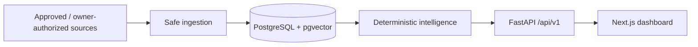

<div align="center">

# DevRadar

**Job Market Intelligence có provenance cho thị trường tuyển dụng IT Việt Nam.**

DevRadar biến job posting công khai thành dữ liệu có thể tìm kiếm, phân tích và đối chiếu — từ ingestion an toàn đến semantic search, CV matching và dashboard Việt/Anh.


[Khám phá sản phẩm](#product-showcase) · [Kiến trúc](#architecture-at-a-glance) · [Chạy local](#quick-start) · [Tài liệu](#documentation)

</div>

---

## ✦ Verified snapshot

| `3,339` | `3,339 / 3,339` | `1,003` | `0.9583` |
|---:|---:|---:|---:|
| Canonical jobs | Current embeddings | Accepted deterministic extractions | Semantic held-out Top-1 |

> Snapshot được kiểm chứng tại thời điểm đóng evaluation dataset; đây không phải bộ đếm realtime. Xem [closeout evidence](docs/evidence/V3-006-v3-closeout.md).

<a id="product-showcase"></a>

## ◈ Product showcase

<p align="center">
  
</p>

<p align="center"><sub>UI thật, metric có evidence và data flow có provenance — trong một product overview duy nhất.</sub></p>

## ◎ Why DevRadar

- **Trustworthy ingestion:** allow-list, SSRF guard, provenance, idempotency, deduplication và false-removal protection.
- **Market intelligence:** deterministic extraction, taxonomy, exact pgvector search và trend analytics có denominator.
- **Operator experience:** dashboard Việt/Anh, crawl history, source health, local CV matching và alert workflow.
- **Privacy by boundary:** không giữ file CV gốc mặc định, không log raw CV/secret và không dùng LLM production để thay workflow xác định.

<a id="architecture-at-a-glance"></a>

## ◇ Architecture at a glance



1. **Modular monolith:** một deployable system trước khi cân nhắc distributed infrastructure.
2. **Deterministic-first:** structured data và parser trước LLM fallback.
3. **Provenance-first:** mọi `Job` truy ngược được tới `Source`, `CrawlRun` và `RawJobSnapshot`.

Đọc data flow, module ownership và trust boundary đầy đủ trong [Architecture](docs/ARCHITECTURE.md).

## ◫ Tech stack

| Layer | Technology | Vai trò |
|---|---|---|
| Web | Next.js, React, TypeScript | Dashboard Việt/Anh và same-origin BFF |
| API | Python, FastAPI, Pydantic | REST JSON dưới `/api/v1` và OpenAPI contract |
| Data | PostgreSQL, pgvector, SQLAlchemy, Alembic | System of record, migration và exact vector search |
| Ingestion | HTTP-first, Playwright fallback | Adapter nguồn đã duyệt, raw snapshot và provenance |
| Runtime | Docker Compose | Local/protected topology và reproducible deployment surface |

<a id="quick-start"></a>

## ⚡ Quick Start

### Yêu cầu

- Python `3.13`
- Docker Engine và Docker Compose
- PowerShell trên Windows cho các command bên dưới

### Chạy API và dashboard

```powershell
git clone https://github.com/HPhucTV/DevRadar.git
cd DevRadar

python -m venv .venv
.venv\Scripts\python -m pip install --require-hashes --requirement requirements-dev.lock

docker compose --env-file .env.example up database --wait
docker compose --env-file .env.example run --rm api python -m alembic upgrade head
docker compose --env-file .env.example up api web --wait

Invoke-RestMethod http://127.0.0.1:8000/api/v1/health
.\scripts\web-smoke.ps1 -BaseUrl http://127.0.0.1:3000
```

Mở `http://127.0.0.1:3000`. OpenAPI nằm tại `http://127.0.0.1:8000/docs`.

Các flow opt-in như local authentication, CV matching, DeepSeek synthetic evaluation và custom source được mô tả trong [Operations](docs/OPERATIONS.md), [AI](docs/AI.md) và [Ingestion](docs/INGESTION.md). Không thêm secret thật vào `.env.example` hoặc Git.

### Quality gates

```powershell
.venv\Scripts\python -m pytest
.venv\Scripts\python -m ruff check .
.venv\Scripts\python -m ruff format --check .
.venv\Scripts\python -m mypy
.venv\Scripts\python -m pip check

Set-Location web
npm run check
```

## ⌘ Project map

```text
DevRadar/
├── src/devradar/        # Domain, ingestion, intelligence, API và CLI
├── web/                 # Next.js dashboard
├── migrations/          # Alembic schema history
├── tests/               # Unit, contract và PostgreSQL integration tests
├── docs/                # Product, architecture, ADR, runbook và evidence
├── scripts/             # Smoke, deploy, backup, restore và security gates
├── compose.yaml         # Local API/web/database/crawler topology
└── AGENTS.md            # Working agreements cho human và AI agent
```

<a id="documentation"></a>

## 📚 Documentation

| Tài liệu | Nội dung |
|---|---|
| [Product](docs/PRODUCT.md) | Bài toán, người dùng, phạm vi và non-goals |
| [Architecture](docs/ARCHITECTURE.md) | Module boundary, data flow và topology |
| [Domain model](docs/DOMAIN_MODEL.md) | Ubiquitous language, entity và lifecycle |
| [Ingestion](docs/INGESTION.md) | Source gate, adapter, normalization và change detection |
| [API](docs/API.md) | REST contract dưới `/api/v1` |
| [AI](docs/AI.md) | Deterministic-first, evaluation, privacy và cost boundary |
| [Operations](docs/OPERATIONS.md) | Test, security, deployment, backup và monitoring |
| [Roadmap](docs/ROADMAP.md) | Capability, exit criteria và evidence theo phase |
| [Architecture Decision Records](docs/decisions/README.md) | Các quyết định Accepted, Proposed và Superseded |

## 🛡 Safety boundary

- Public ingestion chỉ dùng `Source` `approved`.
- Custom source là `owner_authorized_local`, yêu cầu `DEVRADAR_CUSTOM_SOURCES_LOCAL_ENABLED=true`, permission acknowledgement và `preview` thành công trước khi enabled.
- CAPTCHA, authentication, paywall, anti-bot hoặc access denial chuyển profile sang `permission_required`; hệ thống không cung cấp bypass.
- Mọi `Job` giữ provenance qua `CrawlRun` và `RawJobSnapshot`; `JobChange` chỉ chuyển `missing`/`removed` sau complete-run gates.
- Raw CV, secrets và PII không được ghi vào log/tracing; external AI không nhận dữ liệu nhạy cảm nếu chưa có explicit privacy configuration.

DevRadar hiện được chứng minh ở local/protected deployment boundary. Repository chưa tuyên bố public HTTPS/provider deployment đã hoàn tất.

---

<div align="center">
  <i>Data pipeline trước. Reasoning sau. Evidence luôn đi cùng claim.</i>
</div>
