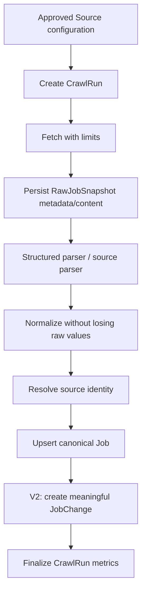
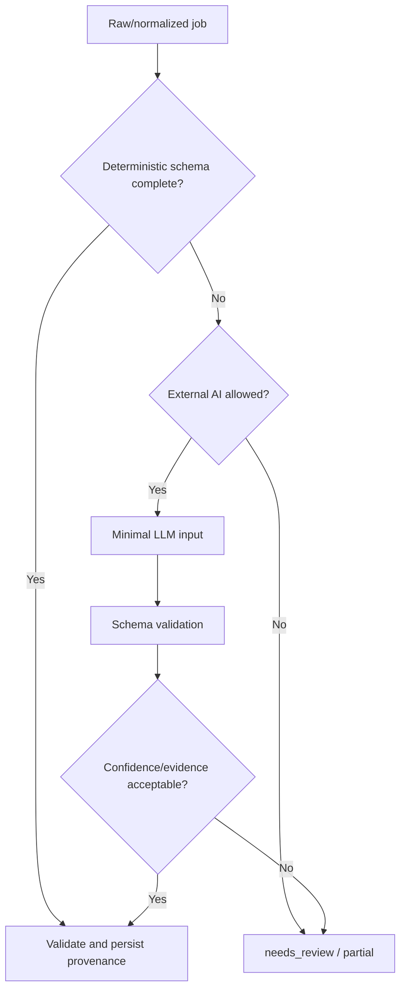

# Architecture

## 1. Trạng thái và phạm vi

Kiến trúc nền tảng là **modular monolith, phase-gated stack** theo [ADR-001](decisions/0001-modular-monolith-and-phase-gated-stack.md). V1 khóa Python, FastAPI, PostgreSQL và Docker Compose; [ADR-005](decisions/0005-sqlalchemy-alembic-and-psycopg.md) khóa SQLAlchemy/Alembic/Psycopg cho persistence V1 sau khi fresh migration và PostgreSQL integration pass. Các thành phần Prefect, pgvector, LangGraph, Next.js và Redis chỉ trở thành dependency khi phase tương ứng bắt đầu và ADR/entry gate cho phép.

Tài liệu này mô tả boundary và data flow. Nó không quy định folder/class chi tiết trước khi scaffold và không biến module logic thành microservice.

## 2. System context

```mermaid
flowchart LR
    U["Portfolio user"] --> API["DevRadar API"]
    U --> WEB["Dashboard - V5"]
    WEB --> API
    OP["Operator / scheduler"] --> ING["Ingestion"]
    SRC["Approved public job sources"] --> ING
    ING --> DB[("PostgreSQL")]
    API --> DB
    AI["Approved LLM or embedding provider - V3+"] <--> INT["Intelligence modules"]
    INT <--> DB
    API --> INT
    ALT["Telegram / Discord - V5+"] <-- ALERT["Alert module"]
    DB --> ALERT
```

External actors và trust level:

- job source, HTML, JSON-LD, redirect và file CV là **untrusted input**;
- LLM/embedding provider là **external processor**, không phải nguồn dữ liệu có thẩm quyền;
- operator local được tin cậy có giới hạn; secret vẫn không được ghi log;
- người dùng public là anonymous/untrusted cho tới khi V6 có auth.

## 3. Module ownership

| Module logic | Trách nhiệm | Bắt đầu | Không sở hữu |
|---|---|---|---|
| `ingestion` | source config, fetch, snapshot, parse, normalization, run result | V1 | public query, AI planning |
| `catalog` | canonical job, skill và dedup từ V1; lifecycle/change history từ V2 | V1 | network fetch, presentation |
| `api` | `/api/v1`, validation, pagination, auth boundary | V1 | crawler parsing, scoring logic |
| `automation` | schedule, retry policy, run orchestration, health | V2 | source-specific extraction |
| `intelligence` | LLM extraction, embeddings, trend queries/evaluation | V3 | authoritative raw data |
| `agents` | bounded planner/validator/analyst decisions | V4 | persistence transaction, deterministic retry engine |
| `matching` | resume profile, score components, explanation evidence | V5 | file transport/security policy |
| `presentation` | Next.js UI, charts, upload experience | V5 | domain rules hoặc data correction |
| `alerts` | rule evaluation, idempotent delivery, delivery history | V5 | source crawling |
| `platform` | config, logging, metrics, DB integration, security primitives | V1 | domain policy riêng của từng module |

Đây là logical boundary trong cùng repository. Không tạo network call giữa các module chỉ để mô phỏng microservice.

## 4. Dependency rules

- Domain rule nằm trong module sở hữu, không nằm trong route, crawler selector hoặc UI.
- `api`, CLI và scheduler gọi cùng application use case thay vì copy workflow.
- Source-specific parser chuyển dữ liệu về raw/normalized contract chung; không ghi trực tiếp schema tùy ý vào database.
- Module AI đọc canonical/raw reference qua application boundary và trả typed result; nó không tự commit trạng thái job.
- Agent đề xuất decision có schema; deterministic workflow validate và áp dụng decision trong transaction.
- Chỉ tạo interface/wrapper khi có ít nhất một external boundary, nhiều implementation thật hoặc testing seam cần thiết.

## 5. Luồng dữ liệu chính

### 5.1. Ingestion



V1 dừng ở current-state upsert và run counters; chưa persist `JobChange` hoặc chạy absence lifecycle. Từ V2, run chỉ được dùng để đánh dấu job vắng mặt khi run đó là `succeeded` và coverage được xác nhận là complete. Failure trước bước finalize không được làm thay đổi trạng thái hiện hữu.

### 5.2. AI extraction



### 5.3. CV matching

Upload validation và text extraction chạy trước. File gốc được xóa sau khi tạo `ResumeProfile` trừ khi người dùng chủ động chọn retention được hỗ trợ. Match engine lưu component score và evidence; LLM chỉ diễn đạt từ evidence đó.

## 6. Runtime topology theo phase

| Phase | Runtime tối thiểu | Trạng thái kiến trúc |
|---|---|---|
| V1 | PostgreSQL, FastAPI process, on-demand crawler/CLI từ cùng codebase | Accepted |
| V2 | V1 + Prefect scheduler/worker hoặc deployment tương đương đã được spike | Proposed đến khi V2 bắt đầu |
| V3 | V2 + LLM/embedding adapter; bật pgvector extension | Proposed |
| V4 | V3 + LangGraph chạy trong worker/application process | Proposed |
| V5 | V4 + Next.js và optional alert connector | Proposed |
| V6 | Public ingress, auth, managed secrets, backup/monitoring; Redis/worker pool nếu metric yêu cầu | Proposed |

Crawler CLI và API dùng cùng code nhưng là entrypoint/process khác nhau. Điều này cho phép scale process sau này mà không cần tách service sớm.

## 7. Trust boundaries và controls

| Boundary | Rủi ro chính | Control bắt buộc |
|---|---|---|
| Source URL/browser subrequest → fetcher | SSRF, redirect escape, oversized/slow response | source allow-list trên mọi request, DNS/IP/redirect re-validation, egress control, timeout, byte limit |
| HTML/JSON-LD → parser | malformed content, injection, parser bomb | content type/size limit, safe parser, no script execution ở HTTP path, fixtures |
| Raw content → LLM | prompt injection, PII leak, cost abuse | treat as data, minimal fields, tool deny-by-default, budget, redaction |
| CV upload → parser | malware/polyglot, decompression bomb, PII | type/signature/size/page limits, isolated parse, no macro execution, short retention |
| API → mutation | unauthorized crawl/data access | local/operator-only trước auth; authenticated role sau V6 |
| App → database | injection, accidental destructive update | parameterized access, migration review, transaction, least privilege |
| App → notification | secret leak, duplicate/spam | secret manager, idempotency key, rate limit, delivery audit |

Chi tiết vận hành nằm trong [OPERATIONS.md](OPERATIONS.md).

## 8. State và consistency

- PostgreSQL là system of record; cache hoặc vector index không được trở thành nguồn authoritative.
- V1 upsert job và last-seen update thuộc cùng transaction logic; từ V2, JobChange liên quan tham gia cùng transaction boundary.
- `RawJobSnapshot` là evidence append-oriented; không sửa snapshot cũ để phản ánh parser mới.
- Reprocessing tạo kết quả extraction/version mới và giữ reference tới input cũ.
- Analytics chỉ đọc run/job data đã đạt trạng thái đủ điều kiện; partial run không được trộn vào trend nếu làm sai denominator.
- Delivery alert dùng idempotency key để retry an toàn.

## 9. Quy tắc thay đổi kiến trúc

ADR mới là bắt buộc khi:

- thêm database, queue, orchestration framework hoặc external AI provider làm default;
- tách module thành service/process với network contract riêng;
- đổi hệ thống lưu trữ authoritative;
- thay đổi API versioning, auth strategy hoặc privacy/retention mặc định;
- cho phép crawler nhận URL ngoài source registry.
