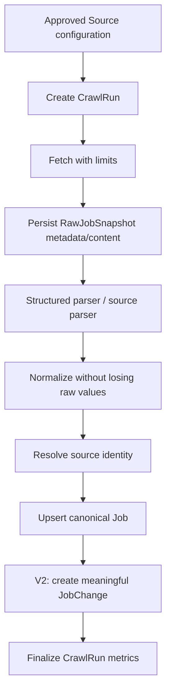
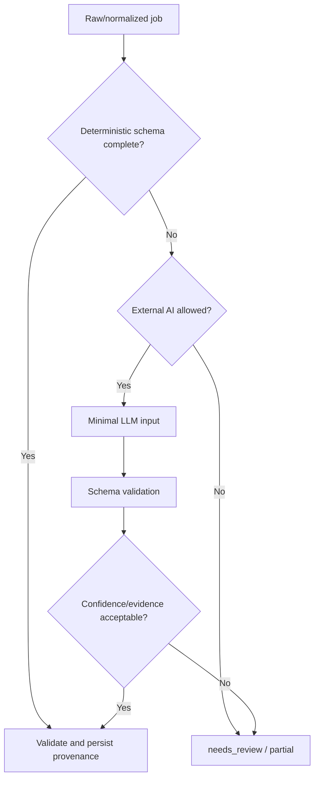
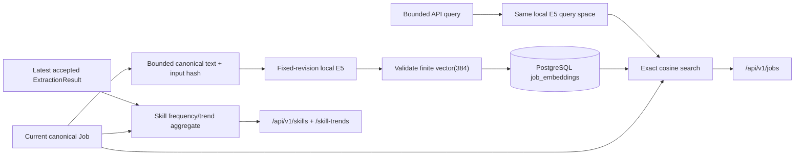
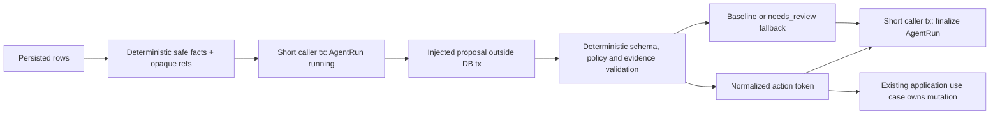

# Architecture

## 1. Trạng thái và phạm vi

Kiến trúc nền tảng là **modular monolith, phase-gated stack** theo [ADR-001](decisions/0001-modular-monolith-and-phase-gated-stack.md). V1 khóa Python, FastAPI, PostgreSQL và Docker Compose; [ADR-005](decisions/0005-sqlalchemy-alembic-and-psycopg.md) khóa SQLAlchemy/Alembic/Psycopg cho persistence V1. V2 đã hoàn tất PostgreSQL-backed direct orchestration theo [ADR-006](decisions/0006-defer-prefect-use-direct-v2-orchestration.md). V3 đã chấp nhận DeepSeek cho synthetic generation boundary theo ADR-008 và fixed-revision local multilingual MiniLM + exact pgvector cho private deployment theo [ADR-010](decisions/0010-accept-fastembed-minilm-semantic-remediation.md). [ADR-012](decisions/0012-accept-direct-v4-agent-workflow-defer-langgraph.md) chấp nhận direct bounded workflow và hoãn LangGraph tới khi có measured durable-workflow need; V4-004 đã implement provider-neutral planner/validator facts và direct executor. Production model adapter, analyst workflow, HNSW, Next.js và Redis vẫn bị phase/evidence gate.

Tài liệu này mô tả boundary và data flow. Nó không quy định folder/class chi tiết trước khi scaffold và không biến module logic thành microservice.

## 2. System context

```mermaid
flowchart LR
    U["Portfolio user"] --> API["DevRadar API"]
    U --> WEB["Dashboard - V5"]
    WEB --> API
    OP["Operator / scheduler"] --> ING["Ingestion"]
    SRC["Approved public job sources"] --> ING
    ING --> DB[("PostgreSQL")]
    API --> DB
    LLM["Approved external LLM boundary - synthetic V3"] <--> INT["Intelligence modules"]
    EMB["Fixed local E5 model - V3"] --> INT
    INT <--> DB
    API --> INT
    ALT["Telegram / Discord - V5+"] <-- ALERT["Alert module"]
    DB --> ALERT
```

External actors và trust level:

- job source, HTML, JSON-LD, redirect và file CV là **untrusted input**;
- external LLM là **external processor**, không phải nguồn dữ liệu có thẩm quyền; local embedding artifact là dependency không đáng tin cho tới khi revision/hash được xác minh;
- operator local được tin cậy có giới hạn; secret vẫn không được ghi log;
- người dùng public là anonymous/untrusted cho tới khi V6 có auth.

## 3. Module ownership

| Module logic | Trách nhiệm | Bắt đầu | Không sở hữu |
|---|---|---|---|
| `ingestion` | source config, fetch, snapshot, parse, normalization, run result | V1 | public query, AI planning |
| `catalog` | canonical job, skill và dedup từ V1; lifecycle/change history từ V2 | V1 | network fetch, presentation |
| `api` | `/api/v1`, validation, pagination, auth boundary | V1 | crawler parsing, scoring logic |
| `automation` | schedule, retry policy, run orchestration, health | V2 | source-specific extraction |
| `intelligence` | LLM extraction, embeddings, trend queries/evaluation | V3 | authoritative raw data |
| `agents` | safe responsibility facts, typed proposal/run state, direct planner/validator workflow, read-only tool authorization, deterministic application validation và caller-owned AgentRun persistence operations | V4 | domain mutation, production provider, analyst aggregate query, graph runtime |
| `matching` | resume profile, score components, explanation evidence | V5 | file transport/security policy |
| `presentation` | Next.js UI, charts, upload experience | V5 | domain rules hoặc data correction |
| `alerts` | rule evaluation, idempotent delivery, delivery history | V5 | source crawling |
| `platform` | config, logging, metrics, DB integration, security primitives | V1 | domain policy riêng của từng module |

Đây là logical boundary trong cùng repository. Không tạo network call giữa các module chỉ để mô phỏng microservice.

## 4. Dependency rules

- Domain rule nằm trong module sở hữu, không nằm trong route, crawler selector hoặc UI.
- `api`, CLI và scheduler gọi cùng application use case thay vì copy workflow.
- Source-specific parser chuyển dữ liệu về raw/normalized contract chung; không ghi trực tiếp schema tùy ý vào database.
- Module AI đọc canonical/raw reference qua application boundary và trả typed result; nó không tự commit trạng thái job.
- Agent đề xuất decision có schema; deterministic workflow validate và áp dụng decision trong transaction.
- Chỉ tạo interface/wrapper khi có ít nhất một external boundary, nhiều implementation thật hoặc testing seam cần thiết.

## 5. Luồng dữ liệu chính

### 5.1. Ingestion



V2 persist `JobChange` và chạy absence lifecycle trong catalog transaction. Run chỉ được dùng để đánh dấu job vắng mặt khi run đó là `succeeded` và coverage được xác nhận là complete. Failure trước bước finalize không được làm thay đổi trạng thái hiện hữu. Operator API chỉ enqueue `pending`; one-shot worker khóa hàng bằng `FOR UPDATE SKIP LOCKED`, chuyển sang `running`, commit trước network work rồi gọi cùng orchestration use case. Đây là process/CLI từ cùng codebase, không phải queue service hoặc distributed worker pool.

### 5.2. AI extraction



### 5.3. Local embedding, search và analytics



Embedding model call chạy ngoài database transaction; persistence re-check Job hash trước insert. Row cũ được giữ làm audit derived data nhưng semantic query chỉ join đúng current hash/input schema/provider/model/revision/dimension. V3 dùng exact cosine và application aggregation vì target chỉ 500–1.000 Job; chưa có HNSW, materialized `JobSkill`, cache hoặc distributed worker.

### 5.4. Agent decision boundary

V4-001 thêm internal decision boundary; V4-002 khóa direct runtime direction; V4-003 thêm bounded run/audit; V4-004 implement provider-neutral planner/validator workflow nhưng chưa thêm live model/provider:



Tool authorization là default deny và responsibility-specific. Proposal/application boundary không nhận database session, raw JD/CV/HTML/ExtractionResult output, arbitrary argument/URL/SQL/shell hoặc mutation handle. Schedule/retry eligibility, quarantine/cap và validator accept/reparse gate đều do deterministic builder/context cấp. V4-004 không gọi tool; `tool_call_count` luôn `0`.

`agents.persistence` chỉ add/lock/flush trong caller-owned transaction. Direct executor dùng transaction 1 insert/commit `running`, chạy proposal/validation/application không giữ Session, rồi transaction 2 lock đúng row, revalidate typed outcome/usage và finalize terminal. Functions persistence không commit/rollback và AgentRun không phải graph checkpoint. Finalize rollback giữ row `running` cùng global `active_slot`; workflow không bypass/reset trạng thái audit. Retry parent lock + unique child tiếp tục khóa đúng một direct attempt 2, khác với hai proposal attempts nội bộ cùng run. Xem [V4-001 evidence](evidence/V4-001-deterministic-agent-policy.md), [V4-002 decision evidence](evidence/V4-002-langgraph-direct-workflow-spike.md), [V4-003 evidence](evidence/V4-003-agent-run-state-safety.md) và [V4-004 evidence](evidence/V4-004-planner-validator-direct-workflow.md).

### 5.5. CV matching

Upload validation và text extraction chạy trước. File gốc được xóa sau khi tạo `ResumeProfile` trừ khi người dùng chủ động chọn retention được hỗ trợ. Match engine lưu component score và evidence; LLM chỉ diễn đạt từ evidence đó.

## 6. Runtime topology theo phase

| Phase | Runtime tối thiểu | Trạng thái kiến trúc |
|---|---|---|
| V1 | PostgreSQL, FastAPI process, on-demand crawler/CLI từ cùng codebase | Accepted |
| V2 | V1 + deterministic scheduler/runner từ cùng codebase, PostgreSQL coordination | Accepted theo ADR-006 |
| V3 | V2 + extraction/taxonomy; local FastEmbed multilingual MiniLM artifact, pgvector `vector(384)`, exact semantic search và bounded analytics | Complete; ADR-010 Accepted cho local/private |
| V4 | V3 + direct typed decision/application/run-state; planner/validator provider-neutral workflow; LangGraph deferred | In progress; V4-004 implemented, analyst/evaluation pending |
| V5 | V4 + Next.js và optional alert connector | Proposed |
| V6 | Public ingress, auth, managed secrets, backup/monitoring; Redis/worker pool nếu metric yêu cầu | Proposed |

Crawler/one-shot worker CLI và API dùng cùng code nhưng là entrypoint/process khác nhau. Điều này giữ network work ngoài HTTP request mà không tách service sớm.

## 7. Trust boundaries và controls

| Boundary | Rủi ro chính | Control bắt buộc |
|---|---|---|
| Source URL/browser subrequest → fetcher | SSRF, redirect escape, oversized/slow response | source allow-list trên mọi request, DNS/IP/redirect re-validation, egress control, timeout, byte limit |
| HTML/JSON-LD → parser | malformed content, injection, parser bomb | content type/size limit, safe parser, no script execution ở HTTP path, fixtures |
| Raw content → LLM | prompt injection, PII leak, cost abuse | treat as data, minimal fields, tool deny-by-default, budget, redaction |
| Model output → AgentRun/application | schema bypass, excessive agency, secret/raw disclosure | strict DecisionEnvelope, deterministic policy/application, hard usage caps, typed redacted audit only |
| Model artifact/query → local embedding | supply-chain tampering, unbounded CPU/input, vector mismatch, query disclosure | fixed revision + artifact SHA-256, local-files-only, length/dimension/finite checks, no raw query/vector logging |
| CV upload → parser | malware/polyglot, decompression bomb, PII | type/signature/size/page limits, isolated parse, no macro execution, short retention |
| API → mutation | unauthorized crawl/data access | local/operator-only trước auth; authenticated role sau V6 |
| App → database | injection, accidental destructive update | parameterized access, migration review, transaction, least privilege |
| App → notification | secret leak, duplicate/spam | secret manager, idempotency key, rate limit, delivery audit |

Chi tiết vận hành nằm trong [OPERATIONS.md](OPERATIONS.md).

## 8. State và consistency

- PostgreSQL là system of record; cache hoặc vector index không được trở thành nguồn authoritative.
- V1 upsert job và last-seen update thuộc cùng transaction logic; từ V2, JobChange liên quan tham gia cùng transaction boundary.
- `RawJobSnapshot` là evidence append-oriented; không sửa snapshot cũ để phản ánh parser mới.
- Reprocessing tạo kết quả extraction/version mới và giữ reference tới input cũ.
- Job embedding là derived row có logical model/hash identity; canonical Job/PostgreSQL vẫn authoritative và stale vector không được rank như current.
- Analytics đọc current Job cohort cùng latest compatible accepted extraction, luôn công bố denominator/coverage; partial run không được làm sai Job lifecycle hoặc cohort.
- AgentRun start/finalize là hai transaction ngắn; external work không giữ row lock, terminal row bất biến và one-running-slot fail closed khi race.
- Delivery alert dùng idempotency key để retry an toàn.

## 9. Quy tắc thay đổi kiến trúc

ADR mới là bắt buộc khi:

- thêm database, queue, orchestration framework hoặc external AI provider làm default;
- tách module thành service/process với network contract riêng;
- đổi hệ thống lưu trữ authoritative;
- thay đổi API versioning, auth strategy hoặc privacy/retention mặc định;
- cho phép crawler nhận URL ngoài source registry.
