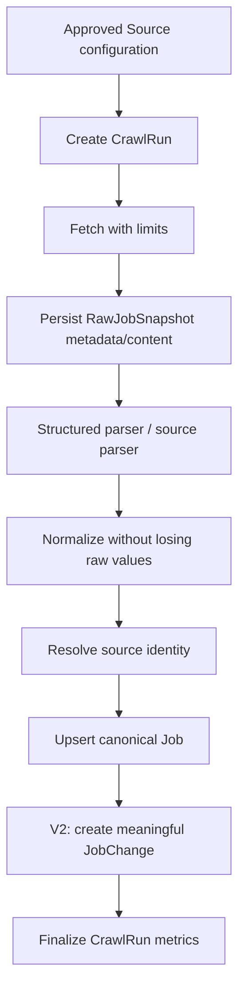
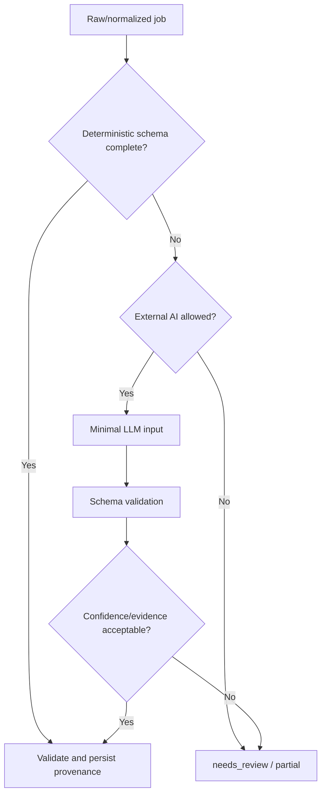
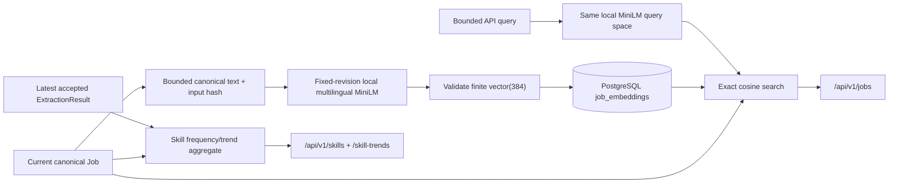
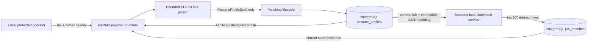

# Architecture

## 1. Trạng thái và phạm vi

Kiến trúc nền tảng là **modular monolith, phase-gated stack** theo [ADR-001](decisions/0001-modular-monolith-and-phase-gated-stack.md). V1 khóa Python, FastAPI, PostgreSQL và Docker Compose; [ADR-005](decisions/0005-sqlalchemy-alembic-and-psycopg.md) khóa SQLAlchemy/Alembic/Psycopg cho persistence V1. V2 đã hoàn tất PostgreSQL-backed direct orchestration theo [ADR-006](decisions/0006-defer-prefect-use-direct-v2-orchestration.md). V3 đã chấp nhận DeepSeek cho synthetic generation boundary theo ADR-008 và fixed-revision local multilingual MiniLM + exact pgvector cho private deployment theo [ADR-010](decisions/0010-accept-fastembed-minilm-semantic-remediation.md). V4 đã đánh giá direct bounded workflow và LangGraph; [ADR-013](decisions/0013-remove-unretained-v4-agent-runtime.md) loại planner/validator/analyst runtime vì không có measurable usefulness gain, còn quyết định defer LangGraph của ADR-012 vẫn hiệu lực. Production model adapter, HNSW, Next.js và Redis vẫn bị phase/evidence gate.

Tài liệu này mô tả boundary và data flow. Nó không quy định folder/class chi tiết trước khi scaffold và không biến module logic thành microservice.

## 2. System context

```mermaid
flowchart LR
    U["Portfolio user"] --> API["DevRadar API"]
    U --> WEB["Dashboard - V5"]
    WEB --> API
    OP["Operator / scheduler"] --> ING["Ingestion"]
    SRC["Approved public job sources"] --> ING
    ING --> DB[("PostgreSQL")]
    API --> DB
    LLM["Approved external LLM boundary - synthetic V3"] <--> INT["Intelligence modules"]
    EMB["Fixed local multilingual MiniLM - V3"] --> INT
    INT <--> DB
    API --> INT
    ALT["Discord webhook - V5-006"] <-- ALERT["Alert module"]
    DB --> ALERT
```

External actors và trust level:

- job source, HTML, JSON-LD, redirect và file CV là **untrusted input**;
- external LLM là **external processor**, không phải nguồn dữ liệu có thẩm quyền; local embedding artifact là dependency không đáng tin cho tới khi revision/hash được xác minh;
- operator local được tin cậy có giới hạn; secret vẫn không được ghi log;
- Discord webhook là external notification boundary; URL chỉ từ environment
  allow-list, request payload bounded và delivery key không được xem là provider
  idempotency guarantee;
- người dùng public là anonymous/untrusted cho tới khi V6 có auth.

## 3. Module ownership

| Module logic | Trách nhiệm | Bắt đầu | Không sở hữu |
|---|---|---|---|
| `ingestion` | source config, fetch, snapshot, parse, normalization, run result | V1 | public query, AI planning |
| `catalog` | canonical job, skill và dedup từ V1; lifecycle/change history từ V2 | V1 | network fetch, presentation |
| `api` | `/api/v1`, validation, pagination, auth boundary | V1 | crawler parsing, scoring logic |
| `automation` | schedule, retry policy, run orchestration, health | V2 | source-specific extraction |
| `intelligence` | LLM extraction, embeddings, trend queries/evaluation | V3 | authoritative raw data |
| `matching` | resume profile, score components, explanation evidence | V5 | file transport/security policy |
| `presentation` | Next.js UI, charts, upload experience | V5 | domain rules hoặc data correction |
| `alerts` | rule evaluation, Discord delivery, idempotent delivery history | V5-006 | source crawling, webhook secret persistence |
| `platform` | config, logging, metrics, DB integration, security primitives | V1 | domain policy riêng của từng module |

Đây là logical boundary trong cùng repository. Không tạo network call giữa các module chỉ để mô phỏng microservice.

## 4. Dependency rules

- Domain rule nằm trong module sở hữu, không nằm trong route, crawler selector hoặc UI.
- `api`, CLI và scheduler gọi cùng application use case thay vì copy workflow.
- Source-specific parser chuyển dữ liệu về raw/normalized contract chung; không ghi trực tiếp schema tùy ý vào database.
- Module AI đọc canonical/raw reference qua application boundary và trả typed result; nó không tự commit trạng thái job.
- Future reasoning path phải có frozen labeled evaluation và ADR trước khi nhận model/provider/runtime boundary; current workflow hoàn toàn deterministic.
- Chỉ tạo interface/wrapper khi có ít nhất một external boundary, nhiều implementation thật hoặc testing seam cần thiết.

## 5. Luồng dữ liệu chính

### 5.1. Ingestion



V2 persist `JobChange` và chạy absence lifecycle trong catalog transaction. Run chỉ được dùng để đánh dấu job vắng mặt khi run đó là `succeeded` và coverage được xác nhận là complete. Failure trước bước finalize không được làm thay đổi trạng thái hiện hữu. Operator API chỉ enqueue `pending`; one-shot worker khóa hàng bằng `FOR UPDATE SKIP LOCKED`, chuyển sang `running`, commit trước network work rồi gọi cùng orchestration use case. Đây là process/CLI từ cùng codebase, không phải queue service hoặc distributed worker pool.

### 5.2. AI extraction



### 5.3. Local embedding, search và analytics



Embedding model call chạy ngoài database transaction; persistence re-check Job hash trước insert. Row cũ được giữ làm audit derived data nhưng semantic query chỉ join đúng current hash/input schema/provider/model/revision/dimension. V3 dùng exact cosine và application aggregation vì target chỉ 500–1.000 Job; chưa có HNSW, materialized `JobSkill`, cache hoặc distributed worker.

### 5.4. V4 agent evaluation closeout

V4-001–V4-005 đã thử typed decision, default-deny policy, bounded run/audit, direct planner/validator và one-skill analyst trend workflow bằng scripted proposal callable. Những artifact đó chứng minh safety/correctness của boundary thử nghiệm, không chứng minh model usefulness.

V4-006 xác nhận cả ba proposal input đã chứa outcome authoritative: planner nhận schedule/retry/quarantine permission đã tính; validator nhận schema/evidence validity và retry eligibility đã tính; analyst nhận exact query/metric refs, direction và required caveat đã tính. Không có frozen label cho phần lựa chọn còn lại và mọi divergence khỏi facts đều bị deterministic gate reject. [ADR-013](decisions/0013-remove-unretained-v4-agent-runtime.md) vì vậy loại package `agents`, current `AgentRun` schema và proposal tests.

Current data flow vẫn là V1–V3 deterministic orchestration, extraction, semantic search và analytics. Các V4 artifact cũ được giữ làm historical evidence: [policy](evidence/V4-001-deterministic-agent-policy.md), [LangGraph/direct spike](evidence/V4-002-langgraph-direct-workflow-spike.md), [run safety](evidence/V4-003-agent-run-state-safety.md), [planner/validator](evidence/V4-004-planner-validator-direct-workflow.md) và [analyst](evidence/V4-005-analyst-skill-trend.md). Không có agent process, provider adapter, model call, tool executor hoặc audit table hiện hành. Future reasoning path cần frozen labeled dataset, measurable improvement gate, privacy boundary và ADR mới.

### 5.5. CV matching

V5-003 đặt parser và lifecycle trong module `matching`; API chỉ sở hữu local gate, owner header, multipart validation và sanitized wire response. Endpoint không khai báo FastAPI `File` body để tránh framework spool trước dependency: gate/owner chạy trước, sau đó request stream bị cap trước khi bounded multipart parse. PDF/DOCX được kiểm MIME/extension/magic/resource limit rồi trích deterministic facts bằng taxonomy hiện có. Pypdf decode limits được hạ tại process boundary và library log bị suppress vì diagnostic có thể echo raw PDF bytes. Chỉ hash và structured profile được commit; file/raw text không đi vào model, database, event hoặc response. V5-004 đọc structured profile để embed local ngoài transaction, exact cosine với current compatible `JobEmbedding`, score deterministic và ghi top 100 vào `job_matches`; không persist resume vector hoặc gửi CV ra external provider. Replay/expiry/delete giữ owner scope và cascade/invisibility artifact.



## 6. Runtime topology theo phase

| Phase | Runtime tối thiểu | Trạng thái kiến trúc |
|---|---|---|
| V1 | PostgreSQL, FastAPI process, on-demand crawler/CLI từ cùng codebase | Accepted |
| V2 | V1 + deterministic scheduler/runner từ cùng codebase, PostgreSQL coordination | Accepted theo ADR-006 |
| V3 | V2 + extraction/taxonomy; local FastEmbed multilingual MiniLM artifact, pgvector `vector(384)`, exact semantic search và bounded analytics | Complete; ADR-010 Accepted cho local/private |
| V4 | Không thêm runtime vào V3; đánh giá rồi loại planner/validator/analyst reasoning path; LangGraph deferred | Complete; ADR-013 Accepted |
| V5 | V3 runtime baseline + Next.js App Router/BFF + local-gated ResumeProfile/JobMatch + bounded Discord alert connector | Complete; V5-001–V5-007 evidence |
| V6 | Public ingress, auth, managed secrets, backup/monitoring; Redis/worker pool nếu metric yêu cầu | In progress; V6-001 complete, V6-002 next |

Crawler/one-shot worker CLI và API dùng cùng code nhưng là entrypoint/process khác nhau. Điều này giữ network work ngoài HTTP request mà không tách service sớm.

`web/` là presentation boundary của V5. App Router dùng Server Components mặc định
và gọi FastAPI trực tiếp khi view cần data; CV matching có same-origin Route
Handler proxy. Trong V5 proxy chỉ chuyển owner header tạm thời; sau ADR-015 nó phải
chuyển tiếp session subject do server đã xác thực và strip identity header do
browser tự gửi. Alert CRUD chưa có UI, chỉ dùng protected FastAPI contract.
`DEVRADAR_API_BASE_URL` là server-only configuration. Client interactivity chỉ
được thêm ở leaf component khi filter/upload/auth thật sự cần.

## 7. Trust boundaries và controls

| Boundary | Rủi ro chính | Control bắt buộc |
|---|---|---|
| Source URL/browser subrequest → fetcher | SSRF, redirect escape, oversized/slow response | source allow-list trên mọi request, DNS/IP/redirect re-validation, egress control, timeout, byte limit |
| HTML/JSON-LD → parser | malformed content, injection, parser bomb | content type/size limit, safe parser, no script execution ở HTTP path, fixtures |
| Raw content → LLM | prompt injection, PII leak, cost abuse | treat as data, minimal fields, tool deny-by-default, budget, redaction |
| External model output → extraction validator | schema bypass, hallucinated evidence, secret/raw disclosure | strict extraction schema, deterministic canonicalization/evidence gate, bounded retry và redacted audit |
| Model artifact/query → local embedding | supply-chain tampering, unbounded CPU/input, vector mismatch, query disclosure | fixed revision + artifact SHA-256, local-files-only, length/dimension/finite checks, no raw query/vector logging |
| CV upload → parser | multipart/file exhaustion, malware/polyglot, decompression bomb, PII/log leak | gate trước body read, total stream + type/signature/size/page/decode limits, no macro/external relationship, suppress untrusted parser diagnostics, short retention |
| Owner header → ResumeProfile | token disclosure, enumeration, cross-owner access | default-disabled local gate, SHA-256 token, owner predicate trên mọi read/delete, generic `404`, safe event allow-list |
| ResumeProfile structured facts + JobEmbedding → JobMatch | stale hash/extraction/model identity, vector mismatch, profile/owner leak, unbounded generation | fixed local model identity + extraction identity, inference ngoài transaction, exact current hash/version join, top-100 bound, owner predicate, response không có hash/vector/raw text |
| API → mutation | unauthorized crawl/data access | local/operator-only trước auth; authenticated role sau V6 |
| App → database | injection, accidental destructive update | parameterized access, migration review, transaction, least privilege |
| App → notification | secret leak, duplicate/spam | secret manager, idempotency key, rate limit, delivery audit |

Chi tiết vận hành nằm trong [OPERATIONS.md](OPERATIONS.md).

## 8. State và consistency

- PostgreSQL là system of record; cache hoặc vector index không được trở thành nguồn authoritative.
- V1 upsert job và last-seen update thuộc cùng transaction logic; từ V2, JobChange liên quan tham gia cùng transaction boundary.
- `RawJobSnapshot` là evidence append-oriented; không sửa snapshot cũ để phản ánh parser mới.
- Reprocessing tạo kết quả extraction/version mới và giữ reference tới input cũ.
- Job embedding là derived row có logical model/hash identity; canonical Job/PostgreSQL vẫn authoritative và stale vector không được rank như current.
- Analytics đọc current Job cohort cùng latest compatible accepted extraction, luôn công bố denominator/coverage; partial run không được làm sai Job lifecycle hoặc cohort.
- Delivery alert dùng idempotency key để retry an toàn.

## 9. Quy tắc thay đổi kiến trúc

ADR mới là bắt buộc khi:

- thêm database, queue, orchestration framework hoặc external AI provider làm default;
- tách module thành service/process với network contract riêng;
- đổi hệ thống lưu trữ authoritative;
- thay đổi API versioning, auth strategy hoặc privacy/retention mặc định;
- cho phép crawler nhận URL ngoài source registry.
