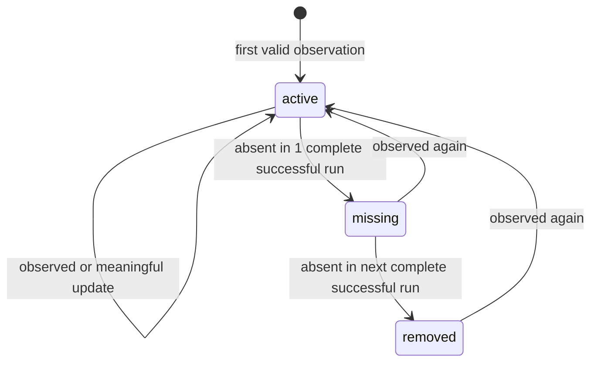

# Domain model

## 1. Mục đích

Tài liệu này là ubiquitous language của DevRadar. Tên entity, enum và state transition ở code, database, API, metric và UI phải dùng cùng nghĩa. Schema vật lý có thể thay đổi qua migration, nhưng không được đổi semantics mà thiếu cập nhật tài liệu và compatibility plan.

## 2. Quy ước chung

- ID nội bộ là opaque identifier; API client không được suy luận ý nghĩa từ ID.
- Timestamp lưu UTC theo ISO 8601; UI có thể hiển thị `Asia/Ho_Chi_Minh`.
- Enum truyền qua API dùng `lower_snake_case`.
- Raw value phải được giữ khi normalization có thể mất thông tin.
- `null` nghĩa là nguồn không cung cấp hoặc hệ thống chưa xác định; không dùng giá trị giả như `0`, `unknown salary` hoặc ngày hiện tại.
- Tiền dùng amount dạng decimal/integer an toàn, ISO 4217 currency và period riêng; V1 không tự đổi currency.
- Job content và CV là untrusted data, không phải instruction cho agent hoặc tool.

## 3. Thuật ngữ

| Thuật ngữ | Nghĩa chuẩn |
|---|---|
| Source | Một nguồn tuyển dụng đã đăng ký cùng policy crawl. |
| CrawlRun | Một lần chạy có boundary, metric và kết quả hoàn chỉnh/không hoàn chỉnh rõ ràng. |
| RawJobSnapshot | Bằng chứng bất biến cho một response/job observation tại một thời điểm. |
| Job | Canonical listing của một source; chưa tự động đồng nhất với listing tương tự ở source khác. |
| JobChange | Từ V2, thay đổi có ý nghĩa giữa hai phiên bản canonical của cùng Job. |
| DuplicateCandidate | Liên kết gợi ý hai Job có thể cùng cơ hội tuyển dụng; không phải auto-merge. |
| Skill | Khái niệm kỹ năng chuẩn hóa trong taxonomy có version. |
| ExtractionResult | Một extraction attempt có schema/version, provenance theo `Job`, validation status và metric an toàn. |
| JobEmbedding | Derived local vector của canonical Job, có input/model/schema identity đầy đủ; không phải nguồn dữ liệu authoritative. |
| ResumeProfile | Hồ sơ có cấu trúc được trích từ CV; không đồng nghĩa file CV gốc. |
| JobMatch | Kết quả match có tổng điểm, component score, evidence và scoring version. |
| AgentRun | Một lần thực thi bounded của đúng một responsibility, lưu opaque input identity, validated decision hoặc safe terminal failure cùng usage audit; không phải trace raw từng step. |
| AlertRule | Tiêu chí người dùng muốn theo dõi. |
| AlertDelivery | Một lần gửi thông báo có idempotency và trạng thái delivery. |

Implementation hiện map `Source`, `CrawlRun`, `RawJobSnapshot` vào module `ingestion`; `Job`, `JobChange` và lifecycle vào `catalog`; dùng UUID/PostgreSQL constraint để giữ provenance, source-scoped identity và idempotent history. Xem [ADR-005](decisions/0005-sqlalchemy-alembic-and-psycopg.md), [V1 upsert evidence](evidence/V1-009-job-upsert.md) và [V2 lifecycle evidence](evidence/V2-003-job-change-and-absence-lifecycle.md).

## 4. Entity chính

### 4.1. Source

| Field logic | Ý nghĩa |
|---|---|
| `id`, `name`, `base_url` | Định danh nội bộ và phạm vi nguồn. |
| `adapter_key` | Parser/adapter được phép dùng; không nhận module path tùy ý từ request. |
| `approval_status` | `candidate`, `approved`, `paused`, `retired`. |
| `health_status` | `unknown`, `healthy`, `degraded`, `unhealthy`, `quarantined`. |
| `consecutive_failures`, `health_reason_code` | Bounded health state và safe reason hiện tại. |
| `baseline_items_found`, `quarantined_at` | Inventory baseline và thời điểm quarantine nếu có. |
| `crawl_frequency` | Lịch đã duyệt; V1 có thể chạy on-demand. |
| `rate_limit_policy` | Request rate/concurrency/timeout/response limit. |
| `allowed_hosts` | Host và redirect target allow-list. |
| `terms_reviewed_at`, `robots_reviewed_at` | Bằng chứng review source gate. |
| `last_crawled_at`, `last_success_at` | Tình trạng vận hành gần nhất. |

`approval_status` và `health_status` độc lập: source có thể hợp lệ về policy nhưng đang lỗi kỹ thuật.

### 4.2. CrawlRun

| Field logic | Ý nghĩa |
|---|---|
| `id`, `source_id` | Định danh run và source. |
| `trigger_type` | `manual`, `scheduled`, `retry`, `replay`. |
| `requested_at` | Thời điểm trigger/request được persist, kể cả khi run còn `pending`. |
| `trigger_key`, `scheduled_for` | Idempotency identity và UTC slot cho trigger có key; scheduled run bắt buộc có cả hai. |
| `requested_by`, `request_hash` | Internal local-principal/request identity đã hash; không thuộc public response. |
| `retry_of_run_id`, `attempt_number` | Retry provenance; một run chỉ có tối đa một direct retry và tổng policy tối đa ba attempt. |
| `retry_after_seconds` | Bounded server hint đã sanitize, tối đa 3.600 giây. |
| `started_at`, `finished_at` | Boundary thời gian. |
| `status` | `pending`, `running`, `succeeded`, `partial`, `failed`, `cancelled`. |
| `coverage_status` | `unknown`, `complete`, `incomplete`; tách khỏi technical status. |
| counters | pages/items found/new/updated/missing/removed/reactivated/failed. |
| `error_code`, `error_summary` | Lỗi đã sanitize; không chứa raw response, secret hoặc PII. |
| `adapter_version`, `config_version` | Khả năng tái hiện run. |

Chỉ run `succeeded` và `coverage_status=complete` được dùng để tăng missing count.

PostgreSQL chỉ cho một `pending|running` CrawlRun mỗi Source. Cùng `(source_id, trigger_key)` trả lại history hiện hữu; nó không tạo execution thứ hai.

Operator API dùng unique `(requested_by, trigger_key)` để cùng key không thể tạo request khác source; raw `Idempotency-Key` không được persist hoặc log.

One-shot worker chọn tối đa một run `pending` theo `requested_at, id`, dùng row lock `SKIP LOCKED`, persist `running/started_at/adapter_version/config_version` rồi mới thực hiện network work. Retry transient tạo CrawlRun mới có `trigger_type=retry`; nó không đổi identity của request ban đầu.

### 4.3. RawJobSnapshot

| Field logic | Ý nghĩa |
|---|---|
| `id`, `crawl_run_id`, `source_id` | Provenance của observation. |
| `source_url`, `external_id` | Canonical identity/provenance của listing từ `ListingRef`; URL transport của feed có thể khác `source_url`. |
| `fetched_at`, `http_status`, `content_type` | Fetch metadata. |
| `raw_content_hash` | Hash của payload canonicalized đủ để cache/replay. |
| `storage_ref` hoặc bounded raw content | Vị trí evidence; cách lưu vật lý được chọn trong V1 scaffold. |
| `parse_status` | `pending`, `parsed`, `invalid`, `failed`, `skipped`. |
| `error_code` | Error taxonomy, không chứa payload nhạy cảm. |

Snapshot là append-oriented. Reparse không sửa snapshot; nó tạo `ExtractionResult` mới.

### 4.4. Job

| Nhóm field | Field logic |
|---|---|
| Identity | `id`, `source_id`, `external_id`, `canonical_url` |
| Nội dung | `title`, `company_name`, `description_text` |
| Location | `location_raw`, normalized city/province, work mode khi có evidence |
| Salary | `salary_raw`, `salary_min`, `salary_max`, `currency`, `salary_period` |
| Requirement | `level_raw`, `levels`, `experience_min`, `experience_max` |
| Time | `posted_at`, `first_seen_at`, `last_seen_at`, `removed_at` |
| State | `status`, `consecutive_missing_count` |
| Provenance | `current_snapshot_id`, `job_content_hash`, extractor/version reference |

`Job` là canonical record trong phạm vi một source. V1 không auto-merge hai Job khác source.

`levels` là tập có thứ tự từ enum `intern`, `fresher`, `junior`, `mid`, `senior`, `lead`, `manager`. Posting “Junior/Mid” được lưu `level_raw` và `levels=[junior, mid]`; không tạo composite enum mơ hồ. Nếu không có evidence, danh sách rỗng thay vì suy đoán từ số năm kinh nghiệm.

### 4.5. JobChange (V2+)

| Field logic | Ý nghĩa |
|---|---|
| `id`, `job_id`, `crawl_run_id` | Định danh event, Job và run xác nhận thay đổi. |
| `from_snapshot_id`, `to_snapshot_id` | Evidence hai phía. |
| `field_name` | Field canonical đã đổi. |
| `old_value`, `new_value` | Giá trị typed/serialized phù hợp. |
| `change_type` | `created`, `updated`, `missing`, `removed`, `reactivated`. |
| `detected_at` | Thời điểm hệ thống xác nhận thay đổi. |

Thay đổi markup, tracking parameter hoặc thứ tự không có nghĩa không được tạo event nếu canonical content không đổi.

### 4.6. Skill và JobSkill

`Skill` gồm `name`, `normalized_name`, `category`, aliases và `taxonomy_version`. Taxonomy V3-004 khóa version `job-taxonomy-v1`; category ban đầu: `language`, `framework`, `database`, `cloud`, `devops`, `messaging`, `testing`, `ai`, `tool`, `other`. Alias map dùng chung với deterministic extraction, không tạo alias thứ hai.

`JobSkill` là logical/materialized relation có thể liên kết Job–Skill với:

- `requirement_type`: `required`, `preferred`, `optional`, `mentioned`;
- `confidence`;
- evidence span/reference;
- `extraction_result_id` và extractor/model version.

Alias mới không được merge skill lịch sử âm thầm; taxonomy change cần version và reprocessing plan.

V3-004 có `TaxonomySkill` typed boundary để map canonical skill sang category. Skill chưa có category được giữ raw name/evidence với `category=other` nhưng outcome là `needs_review`, không tự trở thành canonical mapping.

V3-005 chưa tạo bảng `skills`/`job_skills`: frequency và trend đọc skill từ latest accepted `ExtractionResult` đúng current `job_content_hash`, schema và canonicalization version. Với dataset mục tiêu tối đa 1.000 ở V3, cách này giữ một nguồn extraction duy nhất; chỉ materialize relation khi query profile thực tế chứng minh nhu cầu.

### 4.6A. RoleClassification và BoundedSummary

`RoleClassification` là kết quả role family deterministic có version, gồm `role` (`backend`, `frontend`, `mobile`, `data`, `devops`, `qa`, `security`, `product`, `design`), canonical `levels`, confidence và evidence claims. Marker duy nhất trong title/description có thể `accepted`; không có marker hoặc nhiều role cùng điểm là `needs_review`. Classification không override `Job.levels`.

`BoundedSummary` gồm text một dòng tối đa 420 ký tự và tối đa 8 evidence claims. Builder chỉ dùng classification/skill outcome `accepted`; mỗi evidence phải xuất hiện trong canonical title/description/level input. Unsupported salary, benefit, requirement, role hoặc skill claim bị reject. Classification/summary chưa có bảng persistence hay public endpoint ở V3-004; ingestion và canonical Job không phụ thuộc chúng.

### 4.7. ExtractionResult

| Field logic | Ý nghĩa |
|---|---|
| `id` | UUID của một extraction attempt/result. |
| `input_type`, `input_ref`, `input_hash` | V3-003 hiện chỉ nhận `job`; `input_ref` trỏ `Job.id`, hash là `Job.job_content_hash`, không copy payload vào log. |
| `extractor_type` | `rule` hoặc `llm`; structured data/selector là nguồn upstream của canonical Job, không phải status mới trong V3-003. |
| `extractor_version`, `schema_version`, `model`, `prompt_version` | Version identity để tái lập và tách cache; `model`/`prompt_version` null cho rule. |
| `canonicalization_version` | Version của deterministic alias/field normalization trước validation. |
| `output_data` | Typed payload đã validate; không lưu raw prompt, raw provider output, JD hoặc CV. |
| `validation_status` | `accepted`, `rejected`, `needs_review`; chỉ `accepted` được dùng làm cache hit. |
| `confidence`, `validation_errors` | Confidence tùy contract và danh sách safe `code/path/type`, không chứa rejected value. |
| `latency_ms`, `prompt_tokens`, `completion_tokens`, `estimated_cost_usd` | Metric bounded; cost là estimate, không phải invoice. |
| `created_at` | UTC timestamp của attempt được persist. |

Cache identity có thứ tự cố định `input_type + input_ref + input_hash + extractor_type + extractor_version + schema_version + prompt_version + model + canonicalization_version`. PostgreSQL partial unique index chỉ áp dụng khi `validation_status=accepted`; `rejected` và `needs_review` vẫn có thể có nhiều attempt để audit nhưng không bao giờ trả cache hit. Cache luôn gắn với `input_ref`, vì hai Job khác nhau không được dùng chung result chỉ do trùng content hash.

### 4.7A. JobEmbedding

| Field logic | Ý nghĩa |
|---|---|
| `id`, `job_id` | UUID derived row và canonical Job owner; xóa Job sẽ cascade vector. |
| `input_hash`, `input_schema_version` | `Job.job_content_hash` cùng canonical input schema `job-embedding-input-v2`. |
| `provider`, `model`, `model_revision`, `dimension` | Compatibility identity cố định theo ADR-010: `local_fastembed`, `sentence-transformers/paraphrase-multilingual-MiniLM-L12-v2`, artifact revision đã khóa và 384 dimensions. |
| `embedding` | Local `vector(384)`; không xuất hiện trong API/log. |
| `latency_ms`, `created_at` | Metric bounded và UTC creation time; không chứa query/JD. |

Logical uniqueness là `job_id + input_hash + input_schema_version + provider + model + model_revision`. Job hash đổi không xóa audit row cũ nhưng semantic query chỉ join row tương thích với current hash/model/schema/dimension. V3 dùng exact cosine order; similarity chỉ là ranking score, không phải xác suất phù hợp và không dùng để auto-merge cross-source.

### 4.8. ResumeProfile

| Field logic | Ý nghĩa |
|---|---|
| `id`, optional owner reference | Identity và ownership khi auth tồn tại. |
| `file_name_sanitized`, `content_hash` | Audit mà không dùng path/tên tùy ý. |
| structured profile | skill, experience, role preference, location preference. |
| `embedding`/reference | Chỉ từ V5 cho ResumeProfile và luôn có model version; JobEmbedding V3 là entity derived riêng. |
| `retention_mode`, `expires_at` | Mặc định ephemeral/short-lived. |

File CV gốc không phải entity lưu trữ lâu dài mặc định. Raw text không được ghi vào log hoặc AgentRun.

### 4.9. JobMatch

`JobMatch` liên kết `ResumeProfile` và `Job`, lưu:

- `overall_score`;
- component score như skill, semantic, experience, location và level;
- matched/missing skill reference;
- evidence và explanation;
- `scoring_version`, embedding/model version;
- `created_at` và stale marker khi Job/Profile đổi.

Trọng số cụ thể là `Proposed` cho tới khi V5 có labeled examples. Không ghi “82% match” như xác suất tuyển dụng.

### 4.10. AgentRun

| Nhóm field | Field logic |
|---|---|
| Identity | `id`, `responsibility`, `agent_name`, `agent_version`, `correlation_id` |
| Input | bounded `input_refs`, canonical `input_hash`, fixed `limits_snapshot` |
| Output | nullable `decision_schema_version`, validated `decision_data`, nullable safe model identity |
| Lifecycle | `status`, nullable `failure_code`, `retry_of_run_id`, `attempt_number`, `active_slot` |
| Usage | step/model/tool count, prompt/completion token, latency và estimated cost |
| Time | `started_at`, nullable `finished_at`, `created_at` |

`responsibility` là `planner`, `validator` hoặc `analyst`. `status` là `running`, `succeeded`, `rejected`, `needs_review` hoặc `failed`. `succeeded|rejected` bắt buộc có full validated `agent-decision-v1`; `failed` bắt buộc safe failure code. `needs_review` có thể giữ validated decision để operator xem hoặc không có decision khi provider/limit/input ambiguity chặn outcome an toàn.

`input_refs`, `limits_snapshot` và `decision_data` chỉ được dump từ strict typed model. Bảng không có raw JD/CV/HTML, prompt, chain-of-thought, provider body, secret/header, embedding/vector hoặc arbitrary tool arguments. Một row là aggregate audit cho cả direct run; V4 không có `AgentStep` child entity.

First attempt có `attempt_number=1`, không có parent. Chỉ `failed|needs_review` attempt 1 được tạo đúng một direct retry attempt 2; `succeeded|rejected`, retry-of-retry và child thứ hai đều bị reject. Model retry bên trong một run vẫn tính bằng `model_attempt_count`, không tạo row mới.

### 4.11. AlertRule và AlertDelivery

`AlertRule` lưu filter/match threshold, channel, enabled state và owner. `AlertDelivery` lưu rule/job/job-version, idempotency key, attempt, result và provider message reference đã sanitize.

## 5. Lifecycle

### 5.1. Job lifecycle



Default là hai run complete liên tiếp để chuyển từ `active` sang `removed`: run đầu tạo `missing`, run tiếp theo tạo `removed`. Source có thể đề xuất threshold cao hơn trong approval record, nhưng không được thấp hơn mặc định nếu thiếu bằng chứng. `partial`, `failed`, `cancelled` hoặc coverage `unknown/incomplete` không tăng counter.

V1 chỉ giữ current state. V2 hiện đã kích hoạt lifecycle và JobChange; [integration evidence](evidence/V2-003-job-change-and-absence-lifecycle.md) khóa false-removal/replay behavior.

### 5.2. Source lifecycle

```text
candidate → approved ↔ paused → retired
                 │
                 └─ health: healthy/degraded/unhealthy/quarantined
```

`quarantined` là health control tự động/tạm thời; `paused` là quyết định operator về quyền chạy. Quarantine chặn scheduled/retry trigger nhưng cho phép manual operator recheck; chỉ complete success mới phục hồi `healthy`.

### 5.3. Extraction lifecycle

```text
input → deterministic extraction → accepted
                           └─────→ incomplete → LLM allowed? → validate
                                                         ├─ accepted
                                                         ├─ needs_review
                                                         └─ rejected
```

LLM output không được ghi đè field đã có deterministic parser. `levels`, `experience`, `salary` và
`location` lấy từ canonical input; skill alias được map theo `taxonomy_version` trước strict schema
validation. Ambiguous field giữ `null` và raw value/provenance vẫn được bảo toàn. Đổi rule này phải
bump `canonicalization_version` và re-evaluate extraction result.

V3-003 persist `accepted` rule result ngay khi deterministic extractor đủ dữ liệu và không gọi
provider. Khi incomplete, hệ thống lookup accepted cache trước; cache miss mới gọi provider callable
ngoài transaction ngắn, tối đa hai transient attempts. Provider thiếu hoặc transient exhausted tạo
`needs_review` với deterministic payload; malformed shape, extra field, enum lạ hoặc evidence không
tồn tại tạo `rejected`. Các outcome này không làm Job đổi lifecycle `active → missing → removed`.

### 5.4. AgentRun lifecycle

```text
start → running → succeeded | rejected | needs_review | failed
```

Terminal row bất biến và finalize lại bị reject. `active_slot=1` chỉ tồn tại khi `running`; unique nullable slot giới hạn một AgentRun running toàn hệ thống cho portfolio single-operator. Stuck run không tự reset hoặc bị bypass; recovery policy cần requirement/evidence mới.

Caller commit transaction ngắn tạo `running` trước external model/tool work. External work chạy ngoài database transaction. Caller mở transaction ngắn thứ hai, lock đúng row đang running rồi finalize terminal; persistence function chỉ add/flush và không commit/rollback transaction của caller.

## 6. Identity, deduplication và hashing

Thứ tự identity trong cùng source:

1. stable `external_id` do source cung cấp;
2. normalized canonical URL đã bỏ tracking parameter được duyệt;
3. nếu không có 1 hoặc 2, source chưa đủ điều kiện V1; không thay bằng fingerprint suy đoán.

Fingerprint từ company/title/location và embedding similarity chỉ tạo `DuplicateCandidate`. Auto-merge cross-source nằm ngoài V1 vì false positive có thể làm mất provenance và lịch sử riêng.

Hai hash có mục đích khác nhau:

- `raw_content_hash`: cache/replay raw payload;
- `job_content_hash`: phát hiện thay đổi trên tập canonical field đã định nghĩa, bỏ volatile markup/metadata.

V1 dùng hash schema `job-content-v1`: canonical URL; title/company/description; location raw + normalized; salary raw + structured; level raw + ordered levels; experience range. Fetch/run timestamp, selector và warning không tham gia. Đổi field set hoặc semantics phải tạo hash version mới và reprocessing/migration plan; xem [V1-005 evidence](evidence/V1-005-normalization-and-hashing.md).

## 7. Domain invariants

- Không có Job hợp lệ nếu thiếu source identity, source URL, title, company representation, first/last seen hoặc current snapshot reference.
- `salary_min <= salary_max` khi cả hai có mặt; không suy ra amount từ “competitive” hoặc range không rõ period.
- `last_seen_at >= first_seen_at` và không lấy crawl time làm `posted_at` giả.
- `removed_at` chỉ có khi status `removed`; reactivation giữ lịch sử cũ bằng JobChange.
- Từ V2, không tạo JobChange khi `job_content_hash` không đổi.
- Một JobSkill phải có evidence/extraction provenance.
- Match score phải nằm trong `[0, 1]`, có scoring version và component evidence.
- Agent decision không tự trở thành domain state trước deterministic validation/application step.
- Một thời điểm chỉ có tối đa một `AgentRun.status=running`; attempt 2 phải trỏ một direct eligible attempt 1 và mỗi parent chỉ có một child.
- AgentRun usage không vượt `4` step, `2` model attempt, `4` tool call, `180000 ms`, `8000` total token hoặc `0.05000000 USD` estimated cost.
