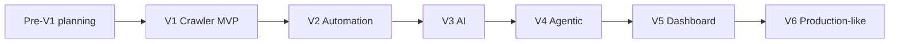

# Roadmap V1–V6

## 1. Trạng thái hiện tại

| Thuộc tính | Giá trị |
|---|---|
| Project status | `implementation` |
| Active phase | `v1` (`blocked`) |
| Code scaffold | Có — FastAPI health + read-only domain API, PostgreSQL schema/migration, test/static gates và Compose local |
| Source approved | `3/3` cho bounded local non-commercial scope |
| Runtime/test evidence | [V1-001 scaffold](evidence/V1-001-scaffold.md), [V1-002 PostgreSQL schema](evidence/V1-002-postgresql-schema.md), [V1-003 source registry](evidence/V1-003-source-registry.md), [V1-004 safe fetch/snapshot](evidence/V1-004-safe-fetch-and-snapshot.md), [V1-005 normalization](evidence/V1-005-normalization-and-hashing.md), [V1-006 NAVER adapter](evidence/V1-006-naver-greenhouse-adapter.md), [V1-007 VNG adapter](evidence/V1-007-vng-adapter.md), [V1-008 MoMo adapter](evidence/V1-008-momo-adapter.md), [V1-009 Job upsert](evidence/V1-009-job-upsert.md), [V1-010 read API](evidence/V1-010-read-api.md), [V1-011 observability](evidence/V1-011-observability.md), [V1-012 Compose/runner](evidence/V1-012-compose-and-runner.md), [V1-013 live inventory](evidence/V1-013-live-inventory.md); `78/500` canonical jobs |

Task-level status có thể được theo dõi bằng `TASK_BOARD.md` cục bộ. File này bị Git ignore và không thay đổi phase gate hoặc exit criteria của roadmap.

Status phase hợp lệ: `proposed`, `planned`, `in_progress`, `blocked`, `complete`. Chỉ một phase được `in_progress`. `complete` yêu cầu toàn bộ exit criteria và evidence, không chỉ task/log claim.

Không có deadline tuần cố định trong roadmap này. Thứ tự dependency quan trọng hơn lịch 8 tuần giả định khi chưa biết capacity và baseline.

## 2. Pre-V1 — Documentation và source discovery

**Status:** `complete` — 2026-08-21.

### Mục tiêu

Chuyển ý tưởng thành contract triển khai được mà không khởi tạo dependency hoặc tuyên bố code đã tồn tại.

### Deliverables

- product, architecture, domain, ingestion, API, AI, operations và roadmap docs;
- AGENTS instructions và ADR nền tảng;
- shortlist source và ba approval records hoàn chỉnh;
- V1 scaffold task breakdown dựa trên source thực tế.

### Exit criteria

- internal link/term/phase consistency được kiểm tra;
- bốn ADR nền tảng có status/rationale rõ;
- ba source thật đạt policy và technical approval gate;
- V1 có source fixtures/spike plan, chưa cần production crawler.

Completion evidence: [VNG Careers](sources/vng-careers.md), [NAVER Vietnam/Greenhouse](sources/naver-vietnam-greenhouse.md), [MoMo Careers](sources/momo-careers.md), [local prerequisites](evidence/PRE-007-local-prerequisites.md) và [Pre-V1 closeout](evidence/PRE-008-pre-v1-closeout.md). GeoComply/Lever giữ `permission_required` và được thay khỏi V1 critical path; xem [record](sources/geocomply-lever.md).

## 3. V1 — Crawler MVP và REST API

**Status:** `blocked` — 2026-08-21; approved inventory chỉ đạt `78/500`.

Evidence hiện có: [V1-001 scaffold](evidence/V1-001-scaffold.md), [V1-002 PostgreSQL schema](evidence/V1-002-postgresql-schema.md), [V1-003 source registry](evidence/V1-003-source-registry.md), [V1-004 safe fetch/snapshot](evidence/V1-004-safe-fetch-and-snapshot.md), [V1-005 normalization](evidence/V1-005-normalization-and-hashing.md), [V1-006 NAVER adapter](evidence/V1-006-naver-greenhouse-adapter.md), [V1-007 VNG adapter](evidence/V1-007-vng-adapter.md), [V1-008 MoMo adapter](evidence/V1-008-momo-adapter.md), [V1-009 Job upsert](evidence/V1-009-job-upsert.md), [V1-010 read API](evidence/V1-010-read-api.md), [V1-011 observability](evidence/V1-011-observability.md), [V1-012 Compose/runner](evidence/V1-012-compose-and-runner.md) và [V1-013 live inventory](evidence/V1-013-live-inventory.md). Đây chưa phải V1 exit evidence vì dataset thật thiếu 422 jobs so với gate.

### Mục tiêu

Tạo data pipeline deterministic có thể crawl ba source thật, replay, normalize, deduplicate trong source và đọc dữ liệu qua API.

### Prerequisite

- Pre-V1 source gate hoàn tất;
- ADR-001 đến ADR-004 được đọc và không có conflict chưa giải quyết;
- local PostgreSQL/Docker capability đã được kiểm tra.

### Deliverables

- Python/FastAPI modular monolith và PostgreSQL migrations;
- source registry cùng ba adapter/fixture;
- RawJobSnapshot, Job, Source và CrawlRun persistence;
- normalization, source-scoped identity, idempotent upsert;
- content-hash current-state update và run counters, chưa lưu change history;
- read-only `/api/v1/jobs`, `/sources`, `/crawl-runs`;
- structured logs/metrics tối thiểu và Docker Compose local;
- verified commands được bổ sung vào README/AGENTS.

### Non-goals

Persisted JobChange, missing/removal lifecycle, Prefect, LLM, embeddings, LangGraph, dashboard, user auth, Redis, auto cross-source merge và distributed crawling.

### Exit criteria

- ba source approved chạy được với fixture và live smoke có kiểm soát;
- tối thiểu 500 canonical jobs thật, không tính fixture;
- replay cùng input idempotent và transaction rollback an toàn;
- failed/partial/empty-anomalous run không làm hỏng hoặc xóa current Job; absence lifecycle chưa được bật;
- REST pagination/filter/error contract và OpenAPI tests pass;
- migration từ database mới, Docker smoke và security negative paths pass;
- metric/log đủ truy vết mỗi job tới run/snapshot/source;
- không unresolved blocker về secret, SSRF hoặc source policy.

Blocker hiện tại: ba source approved đã complete và deduplicate còn 78 canonical jobs (`NAVER 14 + VNG 27 + MoMo 37`). Mở khóa cần một product decision: approve thêm source đủ điều kiện qua source gate, hoặc sửa exit criterion bằng rationale/ADR phù hợp. Không dùng GeoComply/Lever khi còn `permission_required`, không nhân bản dữ liệu và không tự hạ gate.

### Demo evidence

- một run tóm tắt found/new/updated/failed;
- raw snapshot → normalized Job → API response;
- replay không tạo duplicate;
- source/redirect bị policy chặn.

## 4. V2 — Automation, change detection và health

**Status:** `proposed`

### Mục tiêu

Chạy ingestion định kỳ, retry có kiểm soát, giữ change history và phát hiện source degraded mà không false removal.

### Prerequisite

- V1 complete và source identity/coverage ổn định;
- orchestration spike chứng minh Prefect phù hợp với deployment target;
- baseline crawl duration/failure/change rate tồn tại.

### Deliverables

- Prefect schedule/worker từ cùng codebase;
- retry/backoff/error taxonomy và quarantine;
- JobChange cùng lifecycle `active → missing → removed → active`;
- source health/anomaly metric và operator view qua API;
- operator-only `POST /api/v1/crawl-runs` có idempotency.

### Non-goals

Adaptive LLM planner, distributed queue, public mutation API và AI-generated insight.

### Exit criteria

- scheduled runs có evidence qua nhiều chu kỳ;
- retry chỉ xảy ra cho transient errors và không vượt policy;
- hai complete run vắng mặt tạo đúng missing/removal; partial run không đổi state;
- source anomaly/quarantine có test và metric;
- duplicate schedule/API trigger không tạo double processing;
- run history và change API đúng contract.

### Demo evidence

- một job new, updated, missing, removed và reactivated;
- source failed/degraded/quarantined cùng safe error và recovery.

## 5. V3 — AI extraction, taxonomy và semantic search

**Status:** `proposed`

### Mục tiêu

Bổ sung structured extraction và semantic capability có evaluation, trong khi deterministic pipeline vẫn hoạt động độc lập.

### Prerequisite

- V2 complete và đủ dataset đa dạng;
- labeled evaluation dataset/version được review;
- provider/embedding spike có privacy, cost và latency baseline;
- PostgreSQL deployment hỗ trợ pgvector.

### Deliverables

- provider-neutral LLM/embedding adapters;
- versioned ExtractionResult và skill taxonomy;
- versioned role/job classification và bounded AI summary có evidence;
- schema/evidence validation, bounded retry/review và content-hash cache;
- pgvector job embeddings và semantic search;
- skill frequency/trend API có cohort/denominator;
- evaluation/cost report trong CI/release artifact.

### Non-goals

Agent tự điều phối, arbitrary tools, auto-generated claim không có query evidence, external vector database.

### Exit criteria

- target accuracy/hallucination/review/cost được đặt từ baseline và đạt trên held-out suite;
- structured parser đủ dữ liệu không gọi LLM;
- malformed/injected model output bị chặn;
- model/prompt/schema/cache versioning có regression tests;
- provider outage không làm mất ingestion hoặc canonical data;
- semantic result giữ status/source filter và model compatibility.

### Demo evidence

- raw JD → deterministic partial → validated LLM extraction;
- malformed/hallucinated output → retry/review;
- keyword so với semantic search và skill trend có denominator.

## 6. V4 — Agentic decision layer

**Status:** `proposed`

### Mục tiêu

Dùng LangGraph tại ba điểm có reasoning thật: planner, validator và analyst; mọi policy/action vẫn được deterministic code kiểm soát.

### Prerequisite

- V3 complete với stable schemas/evaluation;
- use case agent có baseline deterministic để so sánh;
- tool policy, step/token/cost cap và audit contract được review.

### Deliverables

- typed graph state và bounded planner/validator/analyst nodes;
- allow-listed read/decision tools, không arbitrary HTTP/SQL/shell;
- decision validation/application boundary;
- AgentRun audit, metrics, retry relation và regression suite;
- deterministic fallback khi model/graph unavailable.

### Non-goals

Sáu microservice agent, autonomous source onboarding, autonomous data mutation, unbounded reflection loop hoặc agent-only orchestration.

### Exit criteria

- agent cải thiện metric đã chọn so với baseline hoặc feature bị loại;
- step/tool/policy/timeout/cost limits được negative-test;
- prompt injection không thể đổi allow-list/action;
- quyết định không có evidence bị reject;
- graph failure fallback rõ và không làm hỏng run/domain state;
- agent audit response không lộ raw CV/JD/secret.

### Demo evidence

- planner đề xuất priority trong policy;
- validator phát hiện salary/extraction anomaly và bounded retry/review;
- analyst tạo claim từ aggregate evidence và reject claim thiếu denominator.

## 7. V5 — Dashboard, CV matching và alerts

**Status:** `proposed`

### Mục tiêu

Biến dataset/capability thành trải nghiệm portfolio trực quan, giải thích được và bảo vệ CV.

### Prerequisite

- V4 complete hoặc quyết định rõ phần agent không mang lại giá trị;
- API/schema/query performance đủ cho UI;
- upload parser threat model và scoring evaluation plan;
- demo exposure model quyết định: local/protected/read-only.

### Deliverables

- Next.js dashboard: overview, job explorer/detail, skill analytics, crawler health;
- CV upload → ResumeProfile → versioned JobMatch;
- matched/missing skills, component score và evidence explanation;
- AlertRule/Delivery với Telegram hoặc Discord connector đầu tiên;
- accessibility, browser E2E, retention/delete và idempotency.

### Non-goals

Anonymous public CV storage, xác suất tuyển dụng, auto-apply, recruiter ATS, multiple notification providers nếu một connector đủ demo.

### Exit criteria

- key user journeys chạy trên browser và API thật;
- score formula/version đạt evaluation/ranking criteria đã ghi;
- CV file được validate, cleanup và không xuất hiện trong log;
- profile/match/delete owner boundary pass; nếu chưa auth thì feature chỉ local/protected;
- dashboard nêu cohort/sample size và không phóng đại insight;
- alert retry không duplicate/spam;
- ít nhất 1.000 canonical jobs và demo artifact phản ánh số liệu thật.

### Demo evidence

- top skills/trend với filter và sample size;
- upload CV, top matches, evidence, missing skills và delete;
- job alert idempotent;
- crawler health cùng source degraded.

## 8. V6 — Production-like hardening

**Status:** `proposed`

### Mục tiêu

Đưa demo ra public có kiểm soát, với auth, privacy, reliability và delivery evidence tương xứng.

### Prerequisite

- V5 complete và exposure/product policy được chốt;
- threat model/auth ADR/retention notice;
- baseline load, queue pressure và operational cost.

### Deliverables

- authentication/authorization, owner/operator roles và session/token strategy theo ADR;
- rate limiting, security headers, restricted CORS, managed secrets;
- CI/CD, dependency/container/secret scanning;
- backup/restore, migration/deploy rollback và incident runbooks;
- public monitoring/alerts và budget protection;
- Redis/worker pool chỉ nếu baseline chứng minh process hiện tại không đủ.

### Non-goals

Kubernetes, Kafka, microservice hoặc multi-region nếu không có measured requirement; commercial SLA hoặc multi-tenant recruiter product.

### Exit criteria

- authn/authz negative tests, rate limit và security header tests pass;
- no unresolved reachable critical/high dependency issue;
- backup restore và rollback drill có timestamp/evidence;
- observability trả lời được availability, source health, error, cost và owner-data incidents;
- privacy/retention/delete behavior hiển thị và hoạt động;
- public deployment qua HTTPS, health check và documented recovery.

### Demo evidence

- authenticated owner flow và blocked cross-owner access;
- CI → deploy → smoke → rollback;
- restore drill và operational dashboard;
- measured rationale nếu Redis/worker được thêm hoặc evidence cho quyết định không thêm.

## 9. Quy tắc cập nhật roadmap

- Chỉ đổi status khi kiểm tra exit criteria và link evidence cụ thể.
- Không dùng commit count, số file hoặc “test pass” chung chung thay evidence đúng boundary.
- Khi scope/technology/dependency order đổi, cập nhật ADR và tài liệu liên quan trong cùng change.
- Blocker phải nêu điều kiện mở khóa, owner và evidence còn thiếu.
- Feature bị loại sau evaluation được ghi rõ là quyết định, không để roadmap giả vờ vẫn sẽ làm.
- Tài liệu ý tưởng ban đầu không được sửa để che lịch sử; roadmap này phản ánh kế hoạch thực thi hiện tại.
