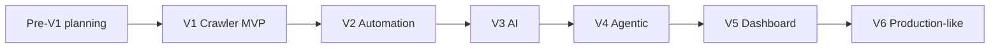

# Roadmap V1–V6

## 1. Trạng thái hiện tại

| Thuộc tính | Giá trị |
|---|---|
| Project status | `implementation` |
| Active phase | `v6` (`in_progress`) |
| Code scaffold | Có — FastAPI health + read-only domain API, PostgreSQL schema/migration, test/static gates và Compose local |
| Source approved | `3` Vietnam V1 sources + `1` V3 secondary remote API source; mỗi source có scope riêng |
| Runtime/test evidence | V1 [complete](evidence/V1-closeout.md); V2 [complete](evidence/V2-006-v2-closeout.md); V3 [complete](evidence/V3-006-v3-closeout.md); V4 historical safety evidence nằm ở [V4-001](evidence/V4-001-deterministic-agent-policy.md)–[V4-005](evidence/V4-005-analyst-skill-trend.md); [V4-006 closeout](evidence/V4-006-agent-usefulness-closeout.md) loại cả ba reasoning path theo ADR-013 |

Task-level status có thể được theo dõi bằng `TASK_BOARD.md` cục bộ. File này bị Git ignore và không thay đổi phase gate hoặc exit criteria của roadmap.

Status phase hợp lệ: `proposed`, `planned`, `in_progress`, `blocked`, `complete`. Chỉ một phase được `in_progress`. `complete` yêu cầu toàn bộ exit criteria và evidence, không chỉ task/log claim.

Không có deadline tuần cố định trong roadmap này. Thứ tự dependency quan trọng hơn lịch 8 tuần giả định khi chưa biết capacity và baseline.

## 2. Pre-V1 — Documentation và source discovery

**Status:** `complete` — 2026-08-21.

### Mục tiêu

Chuyển ý tưởng thành contract triển khai được mà không khởi tạo dependency hoặc tuyên bố code đã tồn tại.

### Deliverables

- product, architecture, domain, ingestion, API, AI, operations và roadmap docs;
- AGENTS instructions và ADR nền tảng;
- shortlist source và ba approval records hoàn chỉnh;
- V1 scaffold task breakdown dựa trên source thực tế.

### Exit criteria

- internal link/term/phase consistency được kiểm tra;
- bốn ADR nền tảng có status/rationale rõ;
- ba source thật đạt policy và technical approval gate;
- V1 có source fixtures/spike plan, chưa cần production crawler.

Completion evidence: [VNG Careers](sources/vng-careers.md), [NAVER Vietnam/Greenhouse](sources/naver-vietnam-greenhouse.md), [MoMo Careers](sources/momo-careers.md), [local prerequisites](evidence/PRE-007-local-prerequisites.md) và [Pre-V1 closeout](evidence/PRE-008-pre-v1-closeout.md). GeoComply/Lever giữ `permission_required` và được thay khỏi V1 critical path; xem [record](sources/geocomply-lever.md).

## 3. V1 — Crawler MVP và REST API

**Status:** `complete` — 2026-08-21.

Completion evidence: [V1 closeout](evidence/V1-closeout.md), cùng [live inventory/regression](evidence/V1-013-live-inventory.md). Product owner đã thay count gate bằng full approved-inventory completeness/identity/replay gate; target `>=500` chuyển sang V3 analytics.

### Mục tiêu

Tạo data pipeline deterministic có thể crawl ba source thật, replay, normalize, deduplicate trong source và đọc dữ liệu qua API.

### Prerequisite

- Pre-V1 source gate hoàn tất;
- ADR-001 đến ADR-004 được đọc và không có conflict chưa giải quyết;
- local PostgreSQL/Docker capability đã được kiểm tra.

### Deliverables

- Python/FastAPI modular monolith và PostgreSQL migrations;
- source registry cùng ba adapter/fixture;
- RawJobSnapshot, Job, Source và CrawlRun persistence;
- normalization, source-scoped identity, idempotent upsert;
- content-hash current-state update và run counters, chưa lưu change history;
- read-only `/api/v1/jobs`, `/sources`, `/crawl-runs`;
- structured logs/metrics tối thiểu và Docker Compose local;
- verified commands được bổ sung vào README/AGENTS.

### Non-goals

Persisted JobChange, missing/removal lifecycle, Prefect, LLM, embeddings, LangGraph, dashboard, user auth, Redis, auto cross-source merge và distributed crawling.

### Exit criteria

- ba source approved chạy được với fixture và live smoke có kiểm soát;
- toàn bộ inventory quan sát được từ tối thiểu ba approved source được ingest bằng current adapter version; latest runs `succeeded + complete` và có inventory snapshot;
- Job count khớp distinct source/external ID, source/canonical URL và current snapshot count;
- replay cùng input idempotent và transaction rollback an toàn;
- failed/partial/empty-anomalous run không làm hỏng hoặc xóa current Job; absence lifecycle chưa được bật;
- REST pagination/filter/error contract và OpenAPI tests pass;
- migration từ database mới, Docker smoke và security negative paths pass;
- metric/log đủ truy vết mỗi job tới run/snapshot/source;
- không unresolved blocker về secret, SSRF hoặc source policy trong bounded local V1 scope.

### Demo evidence

- một run tóm tắt found/new/updated/failed;
- raw snapshot → normalized Job → API response;
- replay không tạo duplicate;
- source/redirect bị policy chặn.

## 4. V2 — Automation, change detection và health

**Status:** `complete` — 2026-08-21.

Completion evidence: [V2 closeout](evidence/V2-006-v2-closeout.md), cùng task evidence [V2-001](evidence/V2-001-prefect-spike.md), [V2-002](evidence/V2-002-direct-orchestration.md), [V2-003](evidence/V2-003-job-change-and-absence-lifecycle.md), [V2-004](evidence/V2-004-source-health-and-quarantine.md) và [V2-005](evidence/V2-005-operator-api-and-history.md).

### Mục tiêu

Chạy ingestion định kỳ, retry có kiểm soát, giữ change history và phát hiện source degraded mà không false removal.

### Prerequisite

- V1 complete và source identity/coverage ổn định;
- orchestration spike đã chốt direct PostgreSQL-backed workflow theo [ADR-006](decisions/0006-defer-prefect-use-direct-v2-orchestration.md);
- baseline crawl duration/failure/change rate tồn tại.

### Deliverables

- deterministic scheduler/runner từ cùng codebase, PostgreSQL coordination và không có control plane riêng;
- retry/backoff/error taxonomy và quarantine;
- JobChange cùng lifecycle `active → missing → removed → active`;
- source health/anomaly metric và operator view qua API;
- operator-only `POST /api/v1/crawl-runs` có idempotency.

### Non-goals

Adaptive LLM planner, distributed queue, public mutation API và AI-generated insight.

### Exit criteria

- scheduled runs có evidence qua nhiều chu kỳ;
- retry chỉ xảy ra cho transient errors và không vượt policy;
- hai complete run vắng mặt tạo đúng missing/removal; partial run không đổi state;
- source anomaly/quarantine có test và metric;
- duplicate schedule/API trigger không tạo double processing;
- run history và change API đúng contract.

### Demo evidence

- một job new, updated, missing, removed và reactivated;
- source failed/degraded/quarantined cùng safe error và recovery.

## 5. V3 — AI extraction, taxonomy và semantic search

**Status:** `complete` — 2026-08-22.

Completion evidence: [V3 closeout](evidence/V3-006-v3-closeout.md), cùng [embedding/search/trend evidence](evidence/V3-005-embeddings-search-trends.md) và [remote source approval](sources/remotejobs-org.md).

### Mục tiêu

Bổ sung structured extraction và semantic capability có evaluation, trong khi deterministic pipeline vẫn hoạt động độc lập.

### Prerequisite

- V2 complete và đủ dataset đa dạng;
- labeled evaluation dataset/version được review;
- provider/embedding spike có privacy, cost và latency baseline;
- PostgreSQL deployment hỗ trợ pgvector.

### Deliverables

- versioned, bounded LLM/embedding provider-model boundaries;
- versioned ExtractionResult và skill taxonomy;
- versioned role/job classification và bounded AI summary có evidence;
- schema/evidence validation, bounded retry/review và content-hash cache;
- pgvector job embeddings và semantic search;
- skill frequency/trend API có cohort/denominator;
- evaluation/cost report trong CI/release artifact.

### Non-goals

Agent tự điều phối, arbitrary tools, auto-generated claim không có query evidence, external vector database.

### Exit criteria

- tối thiểu 500 canonical jobs từ approved/reproducible runs, không tính fixture, có source/cohort label và không dùng remote cohort để claim thị trường Việt Nam, trước khi phase tuyên bố semantic/trend analytics có quy mô;
- target accuracy/hallucination/review/cost được đặt từ baseline và đạt trên held-out suite;
- structured parser đủ dữ liệu không gọi LLM;
- malformed/injected model output bị chặn;
- model/prompt/schema/cache versioning có regression tests;
- provider outage không làm mất ingestion hoặc canonical data;
- semantic result giữ status/source filter và model compatibility.

### Demo evidence

- raw JD → deterministic partial → validated LLM extraction;
- malformed/hallucinated output → retry/review;
- keyword so với semantic search và skill trend có denominator.

## 6. V4 — Agentic decision layer

**Status:** `complete`

### Mục tiêu

Đánh giá xem planner, validator và analyst có tạo measurable usefulness ngoài deterministic baseline hay không; chỉ giữ responsibility vượt improvement và safety gate. LangGraph bị defer theo ADR-012 tới khi có measured durable-workflow need.

### Prerequisite

- V3 complete với stable schemas/evaluation;
- use case agent có baseline deterministic để so sánh;
- tool policy, step/token/cost cap và audit contract được review.

### Deliverables

- frozen deterministic baseline và keep/delete metric;
- typed safety/policy/run-state spikes cho ba responsibility;
- LangGraph/direct-workflow comparison;
- usefulness comparison và explicit retention/removal decision;
- migration/docs cleanup cho feature bị loại.

V4-001–V4-005 đã chứng minh typed schema, default-deny policy, limit/failure behavior và PostgreSQL integration của provider-neutral scripted workflow. Đây là historical evaluation evidence, không phải current runtime capability.

V4-006 áp rule giữ/loại đã đặt trước: cả ba proposal path bị loại vì safe facts đã xác định outcome và không có labeled usefulness gain. Planner chỉ nhận schedule/retry/quarantine permission đã tính; validator nhận schema/evidence validity đã tính; analyst nhận exact query/metric/direction/caveat đã tính. [ADR-013](decisions/0013-remove-unretained-v4-agent-runtime.md) loại package, proposal tests và `AgentRun` schema; [closeout evidence](evidence/V4-006-agent-usefulness-closeout.md) ghi migration/verification. V5 tiếp tục dùng deterministic API/analytics hiện hành.

### Non-goals

Sáu microservice agent, autonomous source onboarding, autonomous data mutation, unbounded reflection loop, agent-only orchestration hoặc LangGraph/checkpointer khi chưa đạt ADR-012 reconsideration trigger.

### Exit criteria

- Improvement gate: đạt bằng nhánh `feature bị loại`; không claim model usefulness.
- Step/tool/policy/timeout/cost và prompt-injection boundaries: historical V4-001–V4-005 tests pass trước removal.
- Unsupported evidence và workflow/model failure: deterministic gate/fallback đã được negative-test; không có current model runtime.
- Privacy: historical audit tests không lộ raw CV/JD/secret; schema/audit runtime sau đó bị drop.
- Current head không còn package `agents` hoặc `AgentRun`; deterministic V1–V3 regression, PostgreSQL migration và static gates pass.

### Demo evidence

- historical planner/validator/analyst safety scenarios trong V4-004/V4-005;
- responsibility comparison và explicit removed outcome trong ADR-013;
- migration round-trip chứng minh historical schema tồn tại ở revision cũ và bị loại ở current head.

## 7. V5 — Dashboard, CV matching và alerts

**Status:** `complete`

### Mục tiêu

Biến dataset/capability thành trải nghiệm portfolio trực quan, giải thích được và bảo vệ CV.

### Prerequisite

- V4 complete;
- API/schema/query performance đủ cho UI;
- upload parser threat model và scoring evaluation plan;
- demo exposure model quyết định: local/protected/read-only.

### Deliverables

- Next.js dashboard: overview, job explorer/detail, skill analytics, crawler health;
- CV upload → ResumeProfile → versioned JobMatch;
- matched/missing skills, component score và evidence explanation;
- AlertRule/Delivery với Telegram hoặc Discord connector đầu tiên;
- accessibility, browser E2E, retention/delete và idempotency.

V5-001 đã chốt `web/` App Router với sáu route truthful, exact package pins và build/HTTP evidence. V5-002 đã nối Server Component views tới FastAPI thật cho jobs, detail/change history, skill analytics và crawler health; API failure/empty/loading states được render fail-closed. V5-003 đã triển khai local-gated PDF/DOCX parser, ephemeral `ResumeProfile`, owner-scoped POST/GET/DELETE, TTL 24 giờ và safe metrics với PostgreSQL/security evidence. V5-004 đã khóa synthetic scoring evaluation, `JobMatch` migration/model, local structured MiniLM generation top 100, stale/current identity và owner-scoped POST/GET API với PostgreSQL/static evidence. V5-005 đã hoàn tất protected CV matching UI và deletion. V5-006 đã hoàn tất một Discord connector local/protected với AlertRule/AlertDelivery, bounded retry và idempotency.

### Non-goals

Anonymous public CV storage, xác suất tuyển dụng, auto-apply, recruiter ATS, multiple notification providers nếu một connector đủ demo.

### Exit criteria

- key user journeys chạy trên browser và API thật;
- score formula/version đạt evaluation/ranking criteria đã ghi;
- CV file được validate, cleanup và không xuất hiện trong log;
- profile/match/delete owner boundary pass; nếu chưa auth thì feature chỉ local/protected;
- dashboard nêu cohort/sample size và không phóng đại insight;
- alert retry không duplicate/spam;
- ít nhất 1.000 canonical jobs và demo artifact phản ánh số liệu thật.

### Demo evidence

- top skills/trend với filter và sample size;
- upload CV, top matches, evidence, missing skills và delete;
- job alert idempotent;
- crawler health cùng source degraded.

V5-003 evidence: [secure CV upload và ResumeProfile lifecycle](evidence/V5-003-secure-cv-upload.md).
V5-004 evidence: [scoring evaluation](evidence/V5-004-scoring-evaluation.md) và [implementation closeout](evidence/V5-004-job-match.md), gồm generation/API/live smoke, full default/PostgreSQL/static/Compose gates. V5-005 đã hoàn tất local/protected CV matching UI và deletion; V5-006 đã hoàn tất alert connector và idempotent delivery.

V5-005 evidence: [CV matching UI và deletion](evidence/V5-005-cv-matching-ui.md).
V5-006 evidence: [Discord alert connector và idempotent delivery](evidence/V5-006-alert-connector.md).
V5-007 evidence: [browser E2E, accessibility baseline và V5 closeout](evidence/V5-007-v5-closeout.md).

## 8. V6 — Production-like hardening

**Status:** `in_progress`

### Mục tiêu

Đưa demo ra public có kiểm soát, với auth, privacy, reliability và delivery evidence tương xứng.

### Prerequisite

- V5 complete và exposure/product policy được chốt;
- threat model/auth ADR/retention notice;
- baseline load, queue pressure và operational cost.

### Deliverables

- authentication/authorization, owner/operator roles và session/token strategy theo ADR;
- rate limiting, security headers, restricted CORS, managed secrets;
- CI/CD, dependency/container/secret scanning;
- backup/restore, migration/deploy rollback và incident runbooks;
- public monitoring/alerts và budget protection;
- Redis/worker pool chỉ nếu baseline chứng minh process hiện tại không đủ.

### Non-goals

Kubernetes, Kafka, microservice hoặc multi-region nếu không có measured requirement; commercial SLA hoặc multi-tenant recruiter product.

### Exit criteria

- authn/authz negative tests, rate limit và security header tests pass;
- no unresolved reachable critical/high dependency issue;
- backup restore và rollback drill có timestamp/evidence;
- observability trả lời được availability, source health, error, cost và owner-data incidents;
- privacy/retention/delete behavior hiển thị và hoạt động;
- public deployment qua HTTPS, health check và documented recovery.

### Demo evidence

- authenticated owner flow và blocked cross-owner access;
- CI → deploy → smoke → rollback;
- restore drill và operational dashboard;
- measured rationale nếu Redis/worker được thêm hoặc evidence cho quyết định không thêm.

### V6-001 evidence

V6-001 đã hoàn tất ở mức documentation gate: [threat model và assessment](threat-model-20260822-202257/0-assessment.md) khóa deployment classification `LOCALHOST_SERVICE`, 10 elements, 3 boundaries, 35 threats, 18 findings và threat coverage inventory. [ADR-015](decisions/0015-accept-v6-authentication-strategy.md) chấp nhận server-side session-based authentication với PostgreSQL session record, CSRF và owner-header migration boundary.

### V6-002 evidence

V6-002 đã triển khai runtime auth theo ADR-015: `auth_users`/`auth_sessions`, PBKDF2 bootstrap password hash,
opaque HttpOnly session cookie, CSRF double-submit + Origin allow-list, owner scope theo user UUID,
operator-only crawl mutation và Next.js login/BFF proxy. Legacy `X-DevRadar-Owner` bị reject khi auth bật;
header compatibility chỉ còn khi auth tắt trên local/protected deployment. [Evidence](evidence/V6-002-authentication.md)
ghi kết quả migration, API/web tests và các boundary chưa thuộc task như rate limit, security headers,
managed secrets và public deploy.

### V6-003 progress (`Done`)

Rate limit process-local, CORS/header policy, BFF body/response budget, deployment-class guard và secret/npm
scan đã có implementation/evidence tại [V6-003 evidence](evidence/V6-003-hardening.md). Trivy pinned digest
đã scan riêng API/crawler image; cả hai có `0` fixable HIGH/CRITICAL finding và gate `--ignore-unfixed`
pass. Unfixed advisory vẫn là residual risk được theo dõi, không phải false-green.

### V6-004 progress (`In Progress`)

CI workflow, Dependabot, Compose image override, migration command surface, deploy/rollback scripts và
health smoke đã có tại [V6-004 evidence](evidence/V6-004-ci-deploy.md). Local fresh-database deploy và
application-image rollback đã pass. GitHub Actions run #21 trên SHA `ebc12f2` đã pass toàn bộ bảy job
Python, PostgreSQL, web, Compose, remote rollback, remote backup/restore và Trivy; bốn artifact retention
14 ngày đã được lưu. GitHub `main` đã bật strict seven-check branch protection, linear history và
conversation resolution; force-push/deletion bị chặn, còn admin bypass được giữ cho single owner.
Public HTTPS ingress và managed secret store vẫn chưa có evidence; không nâng status tới khi các boundary
này được kiểm thử thật. [V6-012](evidence/V6-012-production-web-compose.md) đã hoàn tất Next.js standalone
artifact, local/remote Compose deploy/rollback và three-image Trivy gate trên exact SHA `31c662c`.

### V6-013 closeout (`Done`)

[DigitalOcean production foundation evidence](evidence/V6-013-digitalocean-production-foundation.md) đã
hoàn tất local contract cho single-host ingress/release boundary: patched Caddy scratch image, immutable
database/API/crawler/web/ingress digests, exact-SHA manual workflow, bounded firewall mutation và real
Compose route smoke. Official Caddy/Traefik images bị loại vì còn lần lượt `78/19/10` fixable
HIGH/CRITICAL findings; ADR-022 ghi quyết định thay thế phần Caddy artifact của ADR-021. Exact SHA
`47f2b6b8c4b1222ce5b7bc74ae9e10f26691429c` đã có [remote run #32623904568](https://github.com/HPhucTV/DevRadar/actions/runs/32623904568)
với đủ bảy required jobs success và artifact digests tại [evidence](evidence/V6-013-digitalocean-production-foundation.md).
V6-013 đạt exit criteria. DigitalOcean host/domain/managed secret/public HTTPS evidence đã được chuyển sang danh sách deferred (hoãn cho tới khi có account/domain thật), nên V6-004/V6-005/V6-007 giữ boundary local/protected/CI.

### V6-014 progress (`In Progress`)

[V6-014 evidence](evidence/V6-014-backup-uptime.md) đã khóa custom restic `0.19.1` scratch artifact,
production HTTPS S3 + immutable image validation, `RESTIC_PASSWORD_FILE`, GHCR digest publication, remote
non-root execution, `7 daily + 4 weekly` retention và read-only DigitalOcean Uptime verification. Local
encrypted repository đã pass `init → backup → check → retain → restore` với content match; CI contract build
và Trivy full/fixable scan cho restic đã được thêm, actionlint pass. Chưa có Spaces bucket/key, host/domain,
Uptime check/alert hoặc GitHub production secrets nên chưa có provider backup/list/restore, rotation, measured
RPO/RTO hay Uptime GET evidence. Exact SHA `51d953c742c35e8989fb4490b8ee73541cb9a87a` đã có
[CI run #32627328531](https://github.com/HPhucTV/DevRadar/actions/runs/32627328531) success đủ 7/7 required
jobs; V6-014 vẫn `In Progress` và không nâng V6-005/V6-007.

### V6-005 progress (`In Progress`)

Custom PostgreSQL backup, isolated restore drill, bounded health monitor và runbooks đã có tại
[V6-005 evidence](evidence/V6-005-backup-monitoring.md). Local archive/restore/monitor đã pass; scheduled
remote CI runs #20/#21 cũng đã pass backup/restore drill và lưu metadata artifact không chứa dump. Encrypted
off-host backup có schedule, RPO/RTO, key rotation và public uptime provider evidence còn mở. [V6-011](evidence/V6-011-github-incident-alerting.md)
đã hoàn tất bounded GitHub Issues route với remote dispatch, owner-assigned safe issue và cleanup drill.

### V6-006 evidence (`Done`)

[Queue benchmark](evidence/V6-006-queue-pressure.md) đo 100 PostgreSQL pending claims ở 1/4/8 workers;
4 workers đạt 214.946 claim/s, p95 20.360 ms và 8 workers không tạo thêm throughput. [ADR-018](decisions/0018-do-not-add-redis-worker-pool-after-v6-benchmark.md)
quyết định không thêm Redis/worker pool; topology chỉ được đánh giá lại theo measured triggers.

### V6-007 progress (`In Progress`)

[Public release review](evidence/V6-007-public-release-review.md) đã kiểm các boundary local/protected,
nhưng chưa có HTTPS ingress/hostname thật, managed secret provider và rotation, GitHub Actions run trên
remote đã pass. Vẫn chưa có off-host encrypted backup với RPO/RTO hoặc public privacy/uptime evidence.
Không đóng V6 cho tới khi các provider/operator evidence này tồn tại.

### V6-008 progress (`Done`)

Operator ingestion console tái sử dụng contract Source/CrawlRun hiện hành để tạo vertical slice
`source health → request approved run → pending history` qua authenticated same-origin BFF. Browser chỉ
được gửi `sourceId` và idempotency key; arbitrary URL/config bị chặn. [Evidence](evidence/V6-008-operator-ingestion-console.md)
ghi web contract/build, PostgreSQL auth acceptance và browser smoke.

### V6-009 progress (`Done`)

Operator console đã bổ sung polling bounded cho đúng `CrawlRun` detail sau khi enqueue. BFF thêm
`GET /api/devradar/crawl-runs/{runId}` để không phụ thuộc trang history bị truncate; polling dừng ở
terminal status, timeout 30 giây hoặc lỗi backend an toàn. [Evidence](evidence/V6-009-crawl-status-polling.md)
ghi regression khi list page làm mất pending run, web quality gates, PostgreSQL worker claim và browser
smoke với worker ngoài HTTP. V6-004/V6-005/V6-007 vẫn mở vì thiếu provider/public evidence.

### V6-010 progress (`Done`)

Privacy/source policy center đã có `GET /api/v1/privacy`, same-origin BFF `/api/devradar/privacy`, route
`/privacy` và footer link public. Contract khóa CV file không giữ mặc định, ResumeProfile TTL 24 giờ, owner
deletion, deterministic-first/không external CV-JD LLM và `geocomply-lever=permission_required`. [Evidence](evidence/V6-010-privacy-policy-center.md)
ghi API/web/Compose/browser smoke; không claim public deployment hoặc managed provider.

### V6-016 historical closeout (`Superseded`)

Custom source profiles đã hoàn tất theo [ADR-024](decisions/0024-accept-local-custom-source-profiles-without-bypass.md): owner-local/protected URL, preview gate, deterministic multi-record/card mapping, PostgreSQL schedule và bounded one-document HTTP worker. `owner_authorized_local` không nâng source thành global `approved`, không đi vào global catalog/analytics/matching/alerts; challenge/permission failure bị `blocked` và không retry. [Thiết kế](superpowers/specs/2026-08-23-custom-source-profile-design.md), [implementation plan](superpowers/plans/2026-08-23-custom-source-profile-implementation-plan.md) và [evidence](evidence/V6-016-custom-source-profiles.md) ghi PostgreSQL integration, full gates, live authenticated create → preview → enable → queue → worker → history → retire browser flow, fixture cleanup và security/privacy regression fixes. Production example vẫn default-disable; generic pagination/browser fallback, owner-scoped custom-job catalog và public custom-source support chưa thuộc V6-016; task này không đóng V6.

Đây là historical evidence. ADR-026/V6-020 purge runtime/schema/API/UI của custom profile và thay bằng
một `SourceRecipe` generic localhost-only; đoạn này không mô tả capability active.

### V6-017 closeout (`Done`)

Toàn bộ dashboard đã hỗ trợ Việt/Anh, mặc định Việt, bằng dictionary nội bộ không thêm dependency; locale
được allow-list, giữ qua reload và đồng bộ `<html lang>`, ngày/số, server/client state cùng accessible
`VI | EN`. [ADR-025](decisions/0025-accept-explicit-local-no-login-mode.md) chấp nhận explicit
localhost no-login với singleton PostgreSQL `local-operator`; protected/public vẫn dùng session auth và
invalid deployment matrix fail startup. [Thiết kế](superpowers/specs/2026-08-24-dashboard-i18n-local-no-login-design.md),
[implementation plans](superpowers/plans/2026-08-24-dashboard-i18n-implementation-plan.md) và
[evidence](evidence/V6-017-dashboard-i18n-local-no-login.md) ghi `430` PostgreSQL tests, `55` web tests,
static/build/Compose/API/BFF/browser gates, redirect `/login`, form URL, viewport 320px cùng no-bypass
boundary. Task này chỉ đóng local UX slice, không đóng V6 hoặc claim public deployment.

### V6-020 closeout (`Done`)

[V6-020 no-code Source Recipe](evidence/V6-020-no-code-source-recipes.md) thay static/source-specific adapter
và Custom Source runtime bằng một generic owner-local workflow: listing URL + seniority, versioned
`terms_notice`, bounded preview 3–5 job, visual mapping bằng opaque element IDs, HTTP-first + isolated
Playwright fallback, fixed schedule/manual run và PostgreSQL provenance. Technical barrier luôn fail-closed;
owner acknowledgement không phải legal certification và không cho phép bypass.

One-click Windows launcher build/migrate/start API/web/crawler worker, smoke rồi mở `/sources`; nó không
auto-enable/auto-crawl hoặc xóa volume. Local acceptance có Greenhouse generic route confirmation → `14`
Job có provenance, browser desktop/320px, ten-catalog bounded live matrix và no-bypass negative state.
Independent re-review trả `0 Critical / 0 Important`. Merged SHA `992347d` pass `422` PostgreSQL tests,
`66` web tests + lint/type/build, Ruff/mypy/pip, actual Chromium DNS-pin/no-proxy smoke, ba image build,
secret/supply-chain gates; GitHub Actions run `32843224071` terminal `success` đủ `7/7` jobs. V6-004/
V6-005/V6-007/V6-014 provider/public gates không đổi và V6 không được đóng bởi local capability này.

### V6-021 progress (`Done`)

ADR-027 chấp nhận local document import khi remote access bị từ chối mà không nới no-bypass boundary.
Implementation nhận bounded UTF-8 HTML/JSON/CSV, parse deterministic không network, tái sử dụng canonical
PostgreSQL ingestion/provenance/idempotency và luôn tạo coverage `incomplete`; import không đổi recipe
preview/block/enable state, remote source health hoặc absence/removal lifecycle. Dashboard cung cấp flow
Việt/Anh tại `/sources`. Full Python/PostgreSQL/web/static/runtime/secret gates và controlled-fixture
acceptance được ghi tại [V6-021-local-document-import.md](evidence/V6-021-local-document-import.md), không
live-fetch TopCV/Vieclam24h hoặc claim scheduled access.

### V6-023 closeout (Done)

[V6-023 evidence](evidence/V6-023-source-recipe-identity-purge.md) khóa stable RCP-XXXXXXXX,
lastUsedAt, dashboard deep selection và typed-confirmation transactional purge. Existing DELETE vẫn
chỉ retire/giữ audit; new purge command chỉ xóa graph của owned retired recipe, chặn preview/run active và
giữ ResumeProfile/AlertRule cùng graph khác. Full default/PostgreSQL/static/web/Compose, rollback,
concurrency, disposable API replay/purge và four-width browser gates pass. Task không đổi Source Recipe
local-only/no-bypass policy hoặc các V6 provider/public gate còn mở.

### V6-025 progress (`In Progress`)

[ADR-029](decisions/0029-remove-source-terms-acknowledgement-retain-technical-barriers.md) và
[thiết kế](superpowers/specs/2026-08-27-source-terms-hard-cut-and-job-visibility-design.md) khóa hard cut
runtime terms state trong khi giữ nguyên toàn bộ technical barrier. Migration `f1a3c5e7b902`, domain,
workflow, FastAPI/OpenAPI `privacy-v3` và dashboard đã chuyển sang direct-ready preview; document import trả
server-derived `sourceId`, còn CTA mở source-filtered Jobs tại `/jobs?sourceId=<uuid>`. PostgreSQL/API/web
focused gates đã pass; full Compose/browser/secret/supply-chain evidence và local-only client alignment vẫn
phải hoàn tất trước khi V6-025 chuyển `Done`.

## 9. Quy tắc cập nhật roadmap

- Chỉ đổi status khi kiểm tra exit criteria và link evidence cụ thể.
- Không dùng commit count, số file hoặc “test pass” chung chung thay evidence đúng boundary.
- Khi scope/technology/dependency order đổi, cập nhật ADR và tài liệu liên quan trong cùng change.
- Blocker phải nêu điều kiện mở khóa, owner và evidence còn thiếu.
- Feature bị loại sau evaluation được ghi rõ là quyết định, không để roadmap giả vờ vẫn sẽ làm.
- Tài liệu ý tưởng ban đầu không được sửa để che lịch sử; roadmap này phản ánh kế hoạch thực thi hiện tại.
