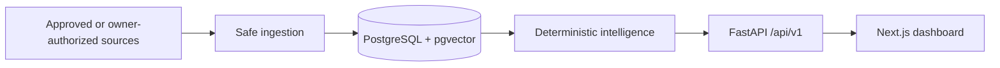

# Portfolio-first README Implementation Plan

> **For agentic workers:** REQUIRED SUB-SKILL: Use superpowers:subagent-driven-development (recommended) or superpowers:executing-plans to implement this plan task-by-task. Steps use checkbox (`- [ ]`) syntax for tracking.

**Goal:** Thay README hiện tại bằng một entry point portfolio-first theo phong cách Evidence-led Editorial, dùng ảnh UI thật, claim đã kiểm chứng và không hiển thị nhãn `V6`, rồi push thay đổi lên `origin/main`.

**Architecture:** Chỉ thay đổi presentation/documentation: ba PNG trong `docs/assets/readme/` và một `README.md` cô đọng. README giữ tài liệu chuyên sâu làm nguồn sự thật, dùng relative links tới docs hiện hành và Mermaid cho kiến trúc; không thay đổi code, dependency, API, config hoặc roadmap.

**Tech Stack:** GitHub-flavored Markdown, Mermaid, HTML alignment markup, Playwright screenshot CLI, PowerShell, pytest, Git.

---

## File map

- Create `docs/assets/readme/dashboard-overview.png`: ảnh hero/product overview từ route `/`.
- Create `docs/assets/readme/analytics.png`: ảnh semantic/trend analytics từ route `/analytics`.
- Create `docs/assets/readme/sources.png`: ảnh source/operator workflow từ route `/sources`.
- Modify `README.md`: portfolio entry point, verified snapshot, gallery, capability summary, architecture, stack, Quick Start, project map, docs và safety boundary.
- Preserve `docs/ROADMAP.md`, evidence, ADR và mọi source/config/test file: không sửa contract để khớp README.

### Task 1: Capture safe product screenshots

**Files:**

- Create: `docs/assets/readme/dashboard-overview.png`
- Create: `docs/assets/readme/analytics.png`
- Create: `docs/assets/readme/sources.png`

- [ ] **Step 1: Verify the existing local runtime**

Run:

```powershell
Invoke-WebRequest -UseBasicParsing http://127.0.0.1:3000/ | Select-Object StatusCode
Invoke-WebRequest -UseBasicParsing http://127.0.0.1:3000/analytics | Select-Object StatusCode
Invoke-WebRequest -UseBasicParsing http://127.0.0.1:3000/sources | Select-Object StatusCode
Invoke-RestMethod http://127.0.0.1:8000/api/v1/health
```

Expected: ba web route trả `200`; health API trả response healthy. Nếu runtime đã dừng, dùng command đã kiểm chứng trong `AGENTS.md`:

```powershell
docker compose --env-file .env.example up database --wait
docker compose --env-file .env.example run --rm api python -m alembic upgrade head
docker compose --env-file .env.example up api web --wait
```

- [ ] **Step 2: Create the asset directory**

Run:

```powershell
New-Item -ItemType Directory -Force docs/assets/readme | Out-Null
```

Expected: `docs/assets/readme/` tồn tại và chưa chứa asset ngoài scope.

- [ ] **Step 3: Capture the three exact routes at 1440×900**

Run:

```powershell
.venv\Scripts\python -m playwright screenshot --viewport-size="1440,900" --wait-for-timeout=2000 --full-page http://127.0.0.1:3000/ docs/assets/readme/dashboard-overview.png
.venv\Scripts\python -m playwright screenshot --viewport-size="1440,900" --wait-for-timeout=2000 --full-page http://127.0.0.1:3000/analytics docs/assets/readme/analytics.png
.venv\Scripts\python -m playwright screenshot --viewport-size="1440,900" --wait-for-timeout=2000 --full-page http://127.0.0.1:3000/sources docs/assets/readme/sources.png
```

Expected: ba PNG được tạo từ UI hiện hành, không sửa app để làm đẹp riêng cho screenshot.

- [ ] **Step 4: Inspect every image at original detail**

Mở từng ảnh bằng image viewer và xác nhận:

- không có browser chrome, DevTools hoặc debug overlay;
- không có token, cookie, credential, raw CV hoặc PII;
- không có error state, skeleton/loading state hoặc capability giả;
- typography và layout không bị crop ở cạnh phải;
- nội dung hiển thị tiếng Việt nhất quán.

Nếu một ảnh vi phạm, xóa đúng ảnh đó và chụp lại cùng route sau khi page ổn định; không chỉnh application code trong task này.

- [ ] **Step 5: Verify image metadata and commit assets**

Run:

```powershell
Get-ChildItem docs/assets/readme/*.png | Select-Object Name,Length
git add docs/assets/readme/dashboard-overview.png docs/assets/readme/analytics.png docs/assets/readme/sources.png
git diff --cached --check
git commit -m "docs: add DevRadar product gallery"
```

Expected: ba file có kích thước lớn hơn `0`; commit chỉ chứa ba PNG.

### Task 2: Rewrite README as an evidence-led portfolio entry point

**Files:**

- Modify: `README.md`
- Reference: `docs/superpowers/specs/2026-08-24-portfolio-readme-design.md`
- Reference: `docs/evidence/V3-006-v3-closeout.md`
- Reference: `docs/ARCHITECTURE.md`
- Reference: `docs/OPERATIONS.md`
- Test: `tests/test_custom_source_docs.py`

- [ ] **Step 1: Replace the README hierarchy**

Viết `README.md` theo đúng thứ tự và nội dung cụ thể sau; có thể xuống dòng lại cho dễ đọc nhưng không đổi claim:

```markdown
<div align="center">

# DevRadar

**Job Market Intelligence có provenance cho thị trường tuyển dụng IT Việt Nam.**

DevRadar biến job posting công khai thành dữ liệu có thể tìm kiếm, phân tích và đối chiếu — từ ingestion an toàn đến semantic search, CV matching và dashboard Việt/Anh.


[Khám phá sản phẩm](#-product-showcase) · [Kiến trúc](#-architecture-at-a-glance) · [Chạy local](#-quick-start) · [Tài liệu](#-documentation)

</div>

## ✦ Verified snapshot

| `3,339` | `3,339 / 3,339` | `1,003` | `0.9583` |
|---:|---:|---:|---:|
| Canonical jobs | Current embeddings | Accepted deterministic extractions | Semantic held-out Top-1 |

> Snapshot kiểm chứng tại thời điểm đóng evaluation dataset; đây không phải bộ đếm realtime. Xem [closeout evidence](docs/evidence/V3-006-v3-closeout.md).

## ◈ Product showcase

<p align="center">
  
</p>

<table>
  <tr>
    <td width="50%"></td>
    <td width="50%"></td>
  </tr>
  <tr>
    <td><strong>Market analytics</strong><br/>Trend có denominator, coverage và semantic evaluation rõ ràng.</td>
    <td><strong>Source operations</strong><br/>Theo dõi source health và cấu hình local custom source không bypass access control.</td>
  </tr>
</table>

## ◎ Why DevRadar

- **Trustworthy ingestion:** allow-list, SSRF guard, provenance, idempotency, deduplication và false-removal protection.
- **Market intelligence:** deterministic extraction, taxonomy, exact pgvector search và trend analytics có denominator.
- **Operator experience:** dashboard Việt/Anh, crawl history, source health, local CV matching và alert workflow.
- **Privacy by boundary:** không lưu file CV gốc mặc định, không log raw CV/secret và không dùng LLM production để thay workflow xác định.

## ◇ Architecture at a glance



1. **Modular monolith:** một deployable system trước khi cân nhắc distributed infrastructure.
2. **Deterministic-first:** structured data và parser trước LLM fallback.
3. **Provenance-first:** mọi `Job` truy ngược được tới `Source`, `CrawlRun` và `RawJobSnapshot`.

## ◫ Tech stack

| Layer | Technology | Vai trò |
|---|---|---|
| Web | Next.js, React, TypeScript | Dashboard Việt/Anh và same-origin BFF |
| API | Python, FastAPI, Pydantic | REST JSON dưới `/api/v1` và OpenAPI contract |
| Data | PostgreSQL, pgvector, SQLAlchemy, Alembic | System of record, migration và exact vector search |
| Ingestion | HTTP-first, Playwright fallback | Adapter nguồn đã duyệt, raw snapshot và provenance |
| Runtime | Docker Compose | Local/protected topology và reproducible deployment surface |

## ⚡ Quick Start

```powershell
git clone https://github.com/HPhucTV/DevRadar.git
cd DevRadar
python -m venv .venv
.venv\Scripts\python -m pip install --require-hashes --requirement requirements-dev.lock
docker compose --env-file .env.example up database --wait
docker compose --env-file .env.example run --rm api python -m alembic upgrade head
docker compose --env-file .env.example up api web --wait
Invoke-RestMethod http://127.0.0.1:8000/api/v1/health
.\scripts\web-smoke.ps1 -BaseUrl http://127.0.0.1:3000
```

Mở `http://127.0.0.1:3000`. Các flow opt-in và production gates nằm trong [Operations](docs/OPERATIONS.md).

## ⌘ Project map

```text
DevRadar/
├── src/devradar/        # Domain, ingestion, intelligence, API và CLI
├── web/                 # Next.js dashboard
├── migrations/          # Alembic schema history
├── tests/               # Unit, contract và PostgreSQL integration tests
├── docs/                # Product, architecture, ADR, runbook và evidence
├── scripts/             # Smoke, deploy, backup, restore và security gates
├── compose.yaml         # Local API/web/database/crawler topology
└── AGENTS.md            # Working agreements cho human và AI agent
```

## 📚 Documentation

- [Product](docs/PRODUCT.md)
- [Architecture](docs/ARCHITECTURE.md)
- [Domain model](docs/DOMAIN_MODEL.md)
- [Ingestion](docs/INGESTION.md)
- [API](docs/API.md)
- [AI](docs/AI.md)
- [Operations](docs/OPERATIONS.md)
- [Roadmap](docs/ROADMAP.md)
- [Architecture Decision Records](docs/decisions/README.md)

## 🛡 Safety boundary

- Public ingestion chỉ dùng `Source` `approved`; custom source là `owner_authorized_local`, yêu cầu `DEVRADAR_CUSTOM_SOURCES_LOCAL_ENABLED=true`, permission acknowledgement và `preview` thành công.
- CAPTCHA, authentication, paywall, anti-bot hoặc access denial chuyển profile sang `permission_required`; hệ thống không cung cấp bypass.
- Mọi `Job` giữ provenance qua `CrawlRun` và `RawJobSnapshot`; `JobChange` chỉ chuyển `missing`/`removed` sau complete-run gates.
- Raw CV, secrets và PII không được ghi vào log/tracing; external AI không nhận dữ liệu nhạy cảm nếu chưa có explicit privacy configuration.

<div align="center"><i>Data pipeline trước. Reasoning sau. Evidence luôn đi cùng claim.</i></div>
```

Giữ nội dung tiếng Việt, technical token tiếng Anh. Không dùng `V6`, phase badge hoặc claim public deployment.

- [ ] **Step 2: Add only stable badges**

Dùng badge tĩnh cho đúng stack hiện hành:

```markdown


```

Không thêm coverage, CI-pass, release hoặc license badge vì chúng có thể tạo claim realtime/stale hoặc chưa có contract tương ứng.

- [ ] **Step 3: Add the verified metrics with provenance**

Ghi rõ snapshot từ V3 closeout evidence:

```markdown
| `3,339` | `3,339 / 3,339` | `1,003` | `0.9583` |
|---:|---:|---:|---:|
| Canonical jobs | Current embeddings | Accepted deterministic extractions | Semantic held-out Top-1 |

> Snapshot kiểm chứng tại thời điểm đóng evaluation dataset; đây không phải bộ đếm realtime.
```

Link “evidence” tới `docs/evidence/V3-006-v3-closeout.md` ngay sau bảng.

- [ ] **Step 4: Preserve operational and safety truth**

Quick Start chỉ dùng command đã có trong `AGENTS.md`:

```powershell
git clone https://github.com/HPhucTV/DevRadar.git
cd DevRadar
python -m venv .venv
.venv\Scripts\python -m pip install --require-hashes --requirement requirements-dev.lock
docker compose --env-file .env.example up database --wait
docker compose --env-file .env.example run --rm api python -m alembic upgrade head
docker compose --env-file .env.example up api web --wait
Invoke-RestMethod http://127.0.0.1:8000/api/v1/health
.\scripts\web-smoke.ps1 -BaseUrl http://127.0.0.1:3000
```

Safety section phải chứa các term chính xác: `approved`, `owner_authorized_local`, `DEVRADAR_CUSTOM_SOURCES_LOCAL_ENABLED`, `permission_required`, `preview`, `CrawlRun`, `RawJobSnapshot`, `JobChange`, `missing`, `removed`, `CAPTCHA`, `anti-bot`, `permission acknowledgement`.

- [ ] **Step 5: Run the narrow contract test**

Run:

```powershell
.venv\Scripts\python -m pytest tests/test_custom_source_docs.py -q
```

Expected: `4 passed` và exit code `0`.

- [ ] **Step 6: Enforce the no-version-label requirement**

Run:

```powershell
$matches = @(Select-String -Path README.md -Pattern '\bV6(?:-|\b)')
if ($matches.Count -ne 0) { $matches; throw 'README still contains V6 labels' }
```

Expected: không có output và exit code `0`.

- [ ] **Step 7: Commit the README rewrite**

Run:

```powershell
git add README.md
git diff --cached --check
git diff --cached --stat
git commit -m "docs: redesign DevRadar portfolio readme"
```

Expected: commit chỉ sửa `README.md`.

### Task 3: Verify links, presentation, repository scope and push

**Files:**

- Verify: `README.md`
- Verify: `docs/assets/readme/dashboard-overview.png`
- Verify: `docs/assets/readme/analytics.png`
- Verify: `docs/assets/readme/sources.png`
- Verify: `docs/superpowers/specs/2026-08-24-portfolio-readme-design.md`
- Verify: `docs/superpowers/plans/2026-08-24-portfolio-readme-implementation-plan.md`

- [ ] **Step 1: Check all local Markdown targets**

Run:

```powershell
$content = Get-Content -Raw README.md
$missing = @()
foreach ($match in [regex]::Matches($content, '!?' + '\[[^\]]*\]\(([^)]+)\)')) {
    $target = $match.Groups[1].Value.Trim()
    if ($target -match '^(https?://|mailto:|#)') { continue }
    $pathPart = [uri]::UnescapeDataString(($target -split '#', 2)[0])
    if ($pathPart -and -not (Test-Path -LiteralPath $pathPart)) { $missing += $target }
}
if ($missing.Count) { $missing | Sort-Object -Unique; throw 'Missing README targets' }
```

Expected: không có missing target và exit code `0`.

- [ ] **Step 2: Run documentation and secret gates**

Run:

```powershell
.venv\Scripts\python -m pytest tests/test_custom_source_docs.py -q
.\scripts\scan-secrets.ps1
git diff --check origin/main..HEAD
```

Expected: `4 passed`; secret scan pass; diff check không có warning cho các commit mới.

- [ ] **Step 3: Inspect the final committed scope**

Run:

```powershell
git status --short --branch
git diff --stat origin/main..HEAD
git log --oneline origin/main..HEAD
git check-ignore -v TASK_BOARD.md .npm-cache 2>$null
```

Expected:

- chỉ `.npm-cache/` là untracked user-owned artifact;
- `TASK_BOARD.md` vẫn ignored;
- diff chỉ gồm spec, plan, README và ba PNG;
- không có code, dependency, config, API hoặc roadmap change.

- [ ] **Step 4: Push `main` and verify the remote SHA**

Run:

```powershell
git -c http.sslBackend=schannel push origin main
$local = git rev-parse HEAD
$remote = (git -c http.sslBackend=schannel ls-remote origin refs/heads/main).Split("`t")[0]
if ($local -ne $remote) { throw "Remote SHA mismatch: local=$local remote=$remote" }
git status --short --branch
```

Expected: push thành công, local SHA bằng remote SHA, branch không ahead/behind và `.npm-cache/` vẫn không được commit.
