# V4-005 Analyst Skill-Trend Responsibility Design

## Status

Design đã được user duyệt theo ba checkpoint ngày 2026-08-22. Implementation chưa bắt đầu; written spec này là gate trước implementation plan.

## Context

V3 đã có `GET /api/v1/skill-trends` và deterministic PostgreSQL analytics với exact Job cohort denominator, analyzed coverage, bounded window tối đa 366 ngày, stable top-skill ordering và versioned extraction/taxonomy metadata. V4-001 đã có typed analyst decision/application boundary; V4-003 có bounded `AgentRun`; V4-004 có safe responsibility inputs cùng direct `build → propose → validate → apply/fallback` workflow cho planner/validator.

V4-005 cần thêm analyst responsibility nhưng không được biến model thành query engine, cho model đọc raw Job/ExtractionResult, thêm tool/SQL capability hoặc tuyên bố usefulness trước V4-006. Slice được duyệt chỉ xử lý một `skill_trend` comparison. `skill_frequency` và `search_summary` giữ ngoài scope.

## Goal

Tạo một analyst responsibility provider-neutral có thể nhận evidence trend đã aggregate, quyết định `publish_insight | reject_claim | needs_review`, và chỉ publish khi exact query, metric, deterministic direction cùng required caveat đều hợp lệ.

V4-005 chứng minh contract/workflow correctness bằng scripted proposal và real PostgreSQL analytics integration. Nó không chứng minh model reasoning tốt hơn deterministic baseline; quyết định giữ hoặc loại analyst thuộc V4-006.

## Chosen approach

Dùng **bounded two-bucket comparison fact**:

1. current analytics use case tiếp tục sở hữu database query, cohort, denominator, coverage và bucket calculation;
2. caller deterministic chiếu response đã validate thành evidence series cho đúng một canonical skill;
3. builder kiểm series, chọn bucket sớm nhất/muộn nhất và chỉ đưa comparison đó qua proposal boundary;
4. proposal chọn typed decision/direction/evidence refs;
5. deterministic application code kiểm toàn bộ claim trước audit.

### Alternatives rejected

#### Đưa full trend series qua proposal

Rejected. Nó tăng token, validation surface và khả năng chọn evidence tùy ý trong khi một comparison đầu/cuối đủ cho V4-005 evaluation slice. Full series có thể được đánh giá lại bằng task/ADR mới nếu V4-006 chứng minh hai bucket thiếu context có thể đo được.

#### Cho analyst tự query PostgreSQL hoặc dùng analytics tool

Rejected. Điều này cấp Session/query/tool capability không cần thiết, trùng deterministic analytics use case và làm rộng trust boundary. Analyst proposal phải chỉ nhận immutable safe facts.

#### Persist aggregate snapshot hoặc insight table mới

Rejected. V4-005 chỉ cần AgentRun audit hiện hữu. Chưa có public insight resource, retention/query requirement hoặc multiple consumer để biện minh migration/table mới.

## Architecture and ownership

Không thêm source module, dependency, migration, API hoặc ADR. V4-005 mở rộng các boundary hiện hữu:

- `agents.decisions`: typed trend direction trong analyst decision data;
- `agents.application`: exact query/metric/direction/caveat publish gate;
- `agents.responsibilities`: strict trend evidence, analyst facts và deterministic builder;
- `agents.workflow`: thêm `AnalystFacts` vào responsibility/proposal union; reuse evaluator/executor không đổi stage/transaction semantics;
- current `api.analytics`: không đổi query contract hoặc import agent module.

Caller xây `AnalystTrendEvidence` từ `SkillTrendQuery`/`SkillTrendResponse` đã validate. V4-005 không thêm API/CLI/worker để tự động gọi analyst; integration test thực hiện projection explicit để chứng minh compatibility với analytics thật. Không tạo Protocol/interface/repository/factory cho một caller chưa tồn tại.

```mermaid
flowchart LR
    Q["Existing bounded SkillTrendQuery"] --> A["Existing PostgreSQL analytics"]
    A --> R["Validated SkillTrendResponse"]
    R --> P["Deterministic one-skill projection"]
    P --> B["Validate series; select first/last buckets"]
    B --> F["analyst-facts-v1 + query/metric refs"]
    F --> S["Short tx: AgentRun running"]
    S --> C["Injected proposal; no Session/tool"]
    C --> V["Decision + exact evidence/application gates"]
    V --> T["Short tx: finalize AgentRun"]
```



## Evidence input contract

### `analyst-trend-evidence-v1`

`AnalystTrendEvidence` là strict frozen Pydantic model, camelCase serialization và `extra=forbid`. Nó chứa:

| Field | Contract |
|---|---|
| `schema_version` | exact `analyst-trend-evidence-v1` |
| `from_date`, `to_date` | inclusive, `from <= to`, tối đa 366 ngày |
| `cohort` | exact literal `firstSeenAt | postedAt` |
| `granularity` | exact literal `day | week | month` |
| `top_skills` | integer `1..20`, lấy nguyên từ `SkillTrendQuery.top_skills` |
| `status` | existing `JobStatus` |
| `source_id` | nullable UUID filter |
| `taxonomy_version` | bounded safe version token |
| `extraction_schema_version` | bounded safe version token |
| `skill_name` | lowercase canonical skill token, 1..100 ký tự |
| `buckets` | ordered tuple 2..366 `AnalystTrendBucketEvidence` |

Evidence không chứa raw Job, JD, ExtractionResult `output_data`, arbitrary aggregate rows, prose, prompt, URL, secret, vector hoặc tool metadata. Hai version token dài `1..100` và khớp exact `^[A-Za-z0-9][A-Za-z0-9._-]{0,99}$`.

Projection test/caller nhận cùng `SkillTrendQuery`, `SkillTrendResponse` đã validate và canonical skill. Nó phải kiểm response meta khớp `from/to/cohort/granularity` của query, giữ đủ và đúng thứ tự mọi response bucket, đồng thời tìm đúng một skill row trùng canonical skill trong mỗi bucket. Skill không nằm trong top-skill response, response có dưới hai bucket, duplicate/missing skill row hoặc query/meta mismatch đều fail closed trước AgentRun. `status`, `source_id` và `top_skills` lấy từ chính query đã dùng cho analytics; taxonomy/extraction version lấy từ response meta.

### `AnalystTrendBucketEvidence`

Mỗi bucket chỉ chứa:

- `period_start`;
- `denominator >= 1`;
- `0 <= analyzed_jobs <= denominator`;
- `0 <= coverage_basis_points <= 10000`;
- `0 <= job_count <= analyzed_jobs`;
- `0 <= share_basis_points <= 10000`.

Basis points là integer để không mang float/non-finite qua trust boundary. Projection không copy `coverage`/`share` float đã round trong REST response; nó tính basis points từ integer `analyzed_jobs`, `job_count` và `denominator`. Builder recompute lần nữa bằng exact integer half-up:

```text
round_half_up_ratio(numerator, denominator)
  = floor((2 * numerator * 10000 + denominator) / (2 * denominator))

coverage_basis_points = round_half_up_ratio(analyzed_jobs, denominator)
share_basis_points    = round_half_up_ratio(job_count, denominator)
```

Input projection phải dùng cùng deterministic rounding rule cho mọi bucket. Mismatch một đơn vị cũng fail closed.

Bucket phải sorted tăng dần, không trùng `period_start` và overlap query window theo granularity:

- day: `from_date <= period_start <= to_date`;
- week: `period_start` là Monday, bucket `[start, start+6]` overlap window;
- month: `period_start.day == 1`, calendar month overlap window.

Builder chọn bucket đầu và cuối của ordered series; cần hai period khác nhau. Không bỏ bucket giữa khỏi input validation, nhưng proposal chỉ nhận hai endpoint. Evidence series tối đa 366 bucket và chỉ cho một skill.

Canonical skill khớp exact `^[a-z0-9][a-z0-9.+#-]{0,99}$`; không whitespace, control character, quote, URL, prompt-like prose hoặc path separator. Invalid skill fail bằng allow-listed build code, không echo value.

## Analyst facts and opaque references

### `analyst-facts-v1`

Proposal nhận strict `AnalystFacts`:

- `aggregate_query_ref`;
- `trend_metric_ref`;
- exact query window/filter/granularity/top-skills/version fields;
- canonical `skill_name`;
- start/end bucket evidence;
- deterministic `share_delta_basis_points` trong `[-10000, 10000]`;
- deterministic `trend_direction`;
- `required_caveat_codes`.

Direction mapping:

| Delta | Direction |
|---:|---|
| `> 0` | `increased` |
| `< 0` | `decreased` |
| `= 0` | `unchanged` |

Nếu start hoặc end coverage `< 10000`, `required_caveat_codes` chứa đúng `low_coverage`; nếu cả hai full coverage thì tuple rỗng. V4-005 không tự thêm `secondary_cohort` vì evidence contract chưa có authoritative cohort classification. `incomplete_window` cũng không được suy đoán chỉ từ two-endpoint comparison.

### Reference identity

Query canonical JSON gồm exact keys `from`, `to`, `cohort`, `granularity`, `topSkills`, `status`, `sourceId`, `taxonomyVersion`, `extractionSchemaVersion`. Date dùng ISO `YYYY-MM-DD`, enum dùng value, UUID dùng lowercase hyphenated string và nullable source được giữ bằng JSON `null`. Serialize UTF-8 với sorted keys, compact separators và không ASCII-escape trước SHA-256. Hash là `aggregate_query_ref.content_hash`; ID là `skill-trend-query:<32 hex prefix>`, version `skill-trend-query-v1`.

Metric canonical JSON dùng cùng serialization rule và gồm full query hash, skill, toàn bộ integer/date field của start/end bucket, delta, direction và required caveat theo order deterministic. SHA-256 là `trend_metric_ref.content_hash`; ID là `skill-trend-metric:<32 hex prefix>`, version `skill-trend-comparison-v1`.

`ResponsibilityInput.input_refs` có exact order `(aggregate_query_ref, trend_metric_ref)`. `ApplicationContext.input_refs` phải bằng exact tuple này. Facts/ref/context mismatch bị strict model validation reject.

Builder failure xảy ra trước AgentRun start, giống planner/validator builder boundary. Error chỉ có allow-listed code/summary cho invalid window, unsafe skill/version, unordered/duplicate bucket, bucket/query mismatch, arithmetic mismatch hoặc insufficient comparison.

## Decision contract changes

Thêm `AnalystTrendDirection`:

```text
increased | decreased | unchanged
```

`AnalystDecisionData` thêm nullable `trend_direction`.

Với `publish_insight`:

- `claim_code` bắt buộc và phải là `skill_trend` trong V4-005 context;
- `trend_direction` bắt buộc;
- `supporting_metric_refs` có đúng một metric ref;
- metric ref phải nằm trong `evidence_refs` và `input_refs`;
- caveat vẫn dùng typed `AnalystCaveatCode`.

Với `reject_claim` hoặc `needs_review`, `claim_code`, `trend_direction`, supporting metric refs và caveat tuple phải rỗng. Không thêm free-form claim/prose/rationale field.

Existing enum values `skill_frequency` và `search_summary` không bị xóa để tránh đổi nghĩa contract lịch sử, nhưng analyst context V4-005 chỉ cho exact expected claim `skill_trend`.

## Deterministic application gate

`ApplicationContext` được mở rộng bằng typed analyst expectations:

- nullable `expected_analyst_claim_code`;
- nullable `expected_analyst_trend_direction`;
- `required_analyst_caveat_codes` bounded tuple.

Builder set expected claim `skill_trend`, expected direction từ delta và required caveat từ coverage. Existing `aggregate_has_denominator`, `aggregate_has_query_reference` là true vì builder chỉ thành công khi evidence hợp lệ; `supported_metric_refs` chứa đúng trend metric ref.

`publish_insight` chỉ được accepted khi đồng thời:

1. context có denominator/query evidence;
2. envelope `evidence_refs` chứa exact aggregate-query ref từ context input;
3. decision claim khớp expected `skill_trend`;
4. supporting metric set bằng exact supported metric set một phần tử và nằm trong evidence;
5. direction khớp deterministic expected direction;
6. decision caveat tuple bằng exact expected tuple: chỉ `(low_coverage,)` khi một trong hai endpoint coverage `< 10000`, ngược lại rỗng;
7. decision không có duplicate ref hoặc duplicate caveat.

Fail bất kỳ gate nào trả existing `ApplicationStatus.REJECTED`, action `REVIEW`, reason `AGGREGATE_EVIDENCE_INVALID`; không retry proposal vì candidate đã schema-valid nhưng policy-invalid.

Valid `reject_claim` trả accepted action `REJECT`; valid `needs_review` trả accepted action `REVIEW`. Hai decision này không cần publish evidence data và không được kèm claim/direction/metric/caveat.

## Workflow and transaction reuse

`ResponsibilityInput` và `ProposalRequest` union thêm `AnalystFacts`; exact ref closure là query + metric. `evaluate_responsibility()`/`execute_responsibility()` không tạo analyst-specific branch ngoài existing typed proposal/application dispatch.

V4-004 limits giữ nguyên:

- tối đa 4 logical stages;
- tối đa 2 proposal attempts;
- 0 tool calls trong direct workflow;
- 180000 ms;
- 8000 total tokens;
- 0.05000000 USD.

Hai transaction giữ nguyên: commit `running`, proposal/validation/application không Session, finalize terminal. Không thêm AgentRun row/column, outer retry, checkpoint hoặc aggregate persistence.

## Terminal and error mapping

| Outcome | AgentRun status | Decision persisted | Retry |
|---|---|---|---|
| Valid `publish_insight` | `succeeded` | Có | Không |
| Valid `reject_claim` | `succeeded` | Có | Không |
| Valid `needs_review` | `needs_review` | Có | Không |
| Direction/query/metric/caveat application reject | `rejected` | Có | Không |
| Malformed/ref-mismatch candidate sau bounded retry | `needs_review/invalid_output` | Không | Tối đa 2 proposal attempts |
| Timeout/provider unavailable | `needs_review` + baseline | Không | Tối đa 2 proposal attempts |
| Usage overflow | `needs_review/limit_exceeded` | Không | Không nhận overflow delta |
| Unexpected execution error | `failed/internal_error` | Không | Không |
| Builder evidence failure | Không tạo AgentRun | Không | Không |
| Finalize failure | Row giữ `running` | Không | Active slot tiếp tục chặn |

Raw evidence/candidate/exception text không được log, persist hoặc trả trong `AgentExecutionOutcome`.

## Security and privacy

- Analytics response và canonical skill vẫn là untrusted boundary input; strict DTO reject extra/free-form content.
- Model không nhận raw Job/JD/CV, ExtractionResult output, SQL, Session, URL, query callable, secret hoặc tool handle.
- Query/metric refs được deterministic code tạo, model không tự invent evidence ngoài input.
- No prose insight means output không có HTML/Markdown/render injection surface.
- Numeric ratios dùng bounded integer basis points; không NaN/Infinity/float drift.
- Safe exceptions không nhận free-form rejected value.
- Scripted proposal fixture không export như production provider.

## Testing strategy

### Unit/TDD

- strict evidence rejects extra/raw/prompt/tool fields, unsafe skill/version, invalid window/granularity/top-skills và malformed UUID;
- projection rejects query/meta mismatch, missing/duplicate selected skill, dropped/reordered bucket và dưới hai response bucket; basis points được tính từ integer counts thay vì REST float;
- bucket ordering/uniqueness/window overlap, denominator/count constraints và exact half-up basis-point arithmetic;
- first/last selection, query/metric hash determinism và content sensitivity;
- deterministic increased/decreased/unchanged direction;
- full versus partial coverage required caveat;
- ResponsibilityInput/ProposalRequest exact analyst facts/ref/context closure;
- analyst decision schema requires publish claim/direction/one metric and forbids claim data on reject/review;
- application rejects missing query evidence, wrong metric, wrong direction, missing/extra/duplicate low-coverage caveat, unsupported claim and extra refs;
- scripted publish/reject/review, malformed twice, ref mismatch, timeout, injection, limit và internal-error scenarios reuse direct workflow;
- safe serialization/error never echoes injected skill, aggregate content hoặc secret.

### PostgreSQL integration

- seed real Jobs + current accepted ExtractionResults;
- call existing `list_skill_trends()` with bounded query/session để tạo real response;
- deterministic test projection tạo one-skill evidence series, builder chọn endpoints;
- scripted analyst proposal sees committed running AgentRun through independent Session;
- second transaction stores exact query/metric refs, validated decision, status/usage và zero tools;
- application-rejected direction/caveat decision persists validated decision nhưng không publish action;
- malformed/injection/finalize failure giữ same V4-004 redaction/active-slot behavior;
- default tests không set database URL và không chạm network.

### V4-006 handoff dataset

V4-005 tests phải để lại deterministic cases cho `increased`, `decreased`, `unchanged`, low coverage, missing query/denominator, wrong metric/direction/caveat, malformed và prompt injection. V4-006 dùng các case này để so sánh analyst proposal với deterministic baseline. Nếu không cải thiện metric đã khóa, analyst reasoning path bị loại; V4-005 không tự đặt accuracy target hoặc claim improvement.

## Documentation during implementation

- `docs/AI.md`: analyst trend evidence/direction/caveat boundary;
- `docs/ARCHITECTURE.md`: aggregate projection và direct workflow reuse;
- `docs/ROADMAP.md` và local board: V4-005 Done, V4-006 Ready chỉ sau full evidence;
- `docs/evidence/V4-005-analyst-skill-trend.md`: RED→GREEN, real analytics integration, terminal/security/full gates và usefulness boundary.

Không đổi `docs/API.md`, `docs/DOMAIN_MODEL.md` hoặc ADR vì không có endpoint/entity/architecture decision mới.

## Non-goals

- `skill_frequency`, `search_summary`, multi-skill hoặc full-series proposal input;
- prose insight, chart annotation, natural-language explanation hoặc UI;
- live DeepSeek/OpenAI/local model, prompt/config/API key hoặc provider adapter;
- analyst-owned SQL/Session/tool/query execution;
- public AgentRun/insight API, CLI/worker/scheduler integration;
- table/index/migration, cached aggregate, materialized metric hoặc insight persistence;
- domain mutation, alert, CV data hoặc external processing;
- LangGraph/checkpointer, queue, Redis hoặc dependency mới;
- usefulness/accuracy comparison và V4 phase closeout, thuộc V4-006.

## Definition of Done

- strict one-skill evidence series và two-endpoint facts fail closed ở mọi invariant mismatch;
- query/metric refs deterministic, content-sensitive và không chứa raw content;
- publish chỉ pass với exact skill-trend claim, query, metric, direction và required caveat;
- direct analyst workflow giữ four-stage/two-attempt/zero-tool/two-transaction boundary;
- real PostgreSQL analytics → evidence → AgentRun integration pass;
- injected/malformed/timeout/limit/internal/finalize failures không lộ raw/secret hoặc mutate domain;
- `.in`/locks, migrations, API và domain model không đổi;
- default/PostgreSQL/static/Alembic/Markdown gates pass;
- V4-005 Done, V4-006 Ready, V4 vẫn `in_progress`;
- evidence nói rõ scripted workflow correctness không phải model usefulness.

## Self-review checklist

- Scope là một `skill_trend` comparison; không có full-series proposal, frequency/search/prose/provider/tool/API/migration.
- Query gồm cả `topSkills`; query/metric/direction/caveat có một authoritative deterministic meaning và exact gate.
- Builder, proposal, application, workflow, persistence và test dùng cùng refs/status/terminal semantics.
- Every failure class maps rõ tới builder error, rejected decision, needs-review fallback, failed run hoặc stuck running finalize boundary.
- V4-006 giữ ownership evaluation/keep-or-delete; V4-005 không claim value chưa đo.
