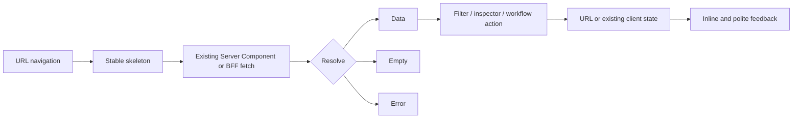

# Full Dashboard Dense Glass Redesign

## Status

Approved by the product owner on 2026-08-26.

## Context

DevRadar đã có chín route web hoạt động, song visual language hiện tại không còn phù hợp với cách sản
phẩm được dùng. Live audit trên `/`, `/jobs`, `/analytics` và `/sources` cho thấy các vấn đề lặp lại:

- serif page title quá lớn khiến phần vận hành bắt đầu thấp dưới fold;
- uppercase, letter spacing và accent tím xuất hiện ở quá nhiều cấp hierarchy;
- job title bị underline nặng, source badge dài và salary/level badge cạnh tranh với nội dung chính;
- job card đang mô phỏng table nhưng thiếu column alignment, làm danh sách khó scan;
- top navigation có bảy destination ngang hàng và không còn chỗ mở rộng hợp lý;
- route/component tự tạo spacing, card và state presentation riêng, nên density và feedback thiếu nhất quán;
- glass, motion, loading, error và empty state chưa có một contract chung.

Owner chọn hướng `Dense Intelligence`, navigation `C1 — Sidebar workspace` và visual treatment
`G2 — Full Glass`. Dashboard được ưu tiên cho desktop; mobile web vẫn phải hoạt động và accessible nhưng
không cần tái hiện toàn bộ mật độ desktop vì notification nhanh dự kiến sẽ được giải quyết bằng một task
Telegram riêng sau này.

Thiết kế này thay toàn bộ visual system của dashboard web. Nó không thay đổi API, domain model, auth,
source policy, ingestion behavior hoặc extension private.

## Goals

1. Cho phép operator scan, lọc và so sánh dữ liệu nhanh trên desktop.
2. Dùng một shell, token system và component language nhất quán trên cả chín route.
3. Áp dụng Full Glass có kiểm soát mà vẫn giữ text contrast và table readability.
4. Bổ sung motion có nghĩa, cancellable và có reduced-motion fallback.
5. Giữ deep link, filter state, form safety, error recovery và accessibility hiện hành.
6. Không thêm dependency chỉ để styling, icon hoặc animation.

## Non-goals

- Không thêm Telegram connector, export backend, global command palette hoặc feature product mới.
- Không thêm dark mode trong task này; light Full Glass là theme duy nhất được chấp nhận hiện tại.
- Không đổi wire contract, BFF route, authentication, authorization hoặc mutation boundary.
- Không thêm chart library, animation framework, component framework hoặc external font.
- Không redesign Chrome extension private.
- Không biến mobile thành primary dashboard surface hoặc thu nhỏ nguyên table desktop vào màn hình hẹp.

## Design decisions

### 1. Desktop-first sidebar workspace

Desktop từ `1024px` dùng sidebar cố định theo ba nhóm:

- Core: Overview, Jobs, Analytics, Crawler health;
- Workflow: Sources, CV Match, Alerts;
- System: Privacy.

Job detail không phải top-level destination. Active route luôn có text, weight, color và surface indicator;
không dùng color đơn lẻ. Top bar chỉ chứa page context, environment, language và action của route hiện tại.

Ở viewport hẹp, sidebar trở thành disclosure/drawer có button tối thiểu `44px`, `aria-expanded`, Escape
close và focus return. Không trộn sidebar và một top-level bottom navigation khác.

### 2. G2 Full Glass with readable data surfaces

Mọi primary surface dùng semantic glass token, nhưng opacity khác nhau theo trách nhiệm:

- shell/sidebar/top bar/filter/drawer: glass rõ, opacity khoảng `45–72%`, blur `18–24px`;
- form/card/workflow panels: opacity khoảng `58–78%`;
- data table, long-form policy và dense text: opacity khoảng `82–94%`.

Ambient background dùng tối đa hai prism glow indigo/cyan/teal. Glow chỉ animate bằng `transform`, không
animate layout properties. Khi `backdrop-filter` không được hỗ trợ, surface chuyển sang opaque equivalent
và giữ nguyên hierarchy/contrast.

### 3. System typography

Không tải Google Font hoặc self-host font mới. Stack chuẩn:

```css
ui-sans-serif, system-ui, -apple-system, "Segoe UI", sans-serif
```

ID, metric và timestamp dùng `ui-monospace, "SFMono-Regular", Consolas, monospace` với tabular figures.

| Role | Desktop size | Intent |
|---|---:|---|
| Display | `32–40px` | Chỉ overview/empty hero ngắn |
| Page title | `24–30px` | Mỗi route một `h1` |
| Section title | `18–22px` | `h2`/panel heading |
| Body | `14–16px`, line-height `1.5–1.6` | Nội dung và mô tả |
| Label | `11–12px` | Field/status/table header |
| Data | `12–14px` mono/tabular | ID, count, date, version |

Không underline job title mặc định. Link có hover/focus state rõ; prose link vẫn có underline khi cần phân
biệt trong đoạn văn. Uppercase và tracking chỉ dùng cho label ngắn, không dùng cho metadata dài.

### 4. Data before decoration

Job list đổi từ card stack sang semantic table/list hybrid:

- title và location/source/date nằm cùng primary cell;
- company, level, state và source là column trên desktop;
- salary chỉ xuất hiện khi có giá trị; missing salary không chiếm primary visual emphasis;
- long source name không bọc phá layout. Presentation helper tạo display label ngắn deterministic, còn raw
  source name vẫn có trong accessible/title detail;
- row hover/focus không đổi kích thước; entire primary title remains a real link.

Collection của level/status chip wrap trước khi shrink. Một essential label không bị ẩn; nếu column bị
loại trên mobile, thông tin đó xuất hiện trong secondary line của primary cell.

## Information architecture and route archetypes

Thay vì mỗi page tự phát minh layout, cả dashboard dùng năm archetype:

| Archetype | Routes | Structure |
|---|---|---|
| Metrics | `/` | KPI, health summary, demand comparison, recent activity |
| Explorer | `/jobs`, `/jobs/[jobId]` | Filter bar, table/list, summary inspector, full detail |
| Intelligence | `/analytics` | Metric header, accessible comparison, trend table |
| Operations | `/crawler-health`, `/sources` | Current state, workflow controls, health/history evidence |
| Form/result | `/cv-match`, `/alerts`, `/privacy` | Form or reader surface, result list, lifecycle/recovery state |

### Overview

Above the fold chỉ gồm concise page context, three to four KPI và current system signal. Recent jobs dùng
compact rows; không render job cards cao trong two-column panel. Skill demand ưu tiên comparison bars và
explicit value labels.

### Jobs and job detail

`/jobs` giữ query/location state trong URL. Desktop có dense table và summary inspector:

- click/Enter trên job title mở summary inspector bằng fields đã có trong list response;
- inspector không fetch API mới và không thay thế deep link;
- inspector có link thật tới `/jobs/[jobId]` để xem description/provenance đầy đủ;
- Escape đóng inspector và trả focus về đúng job title;
- trên mobile, title đi thẳng tới `/jobs/[jobId]`, không mở inspector.

`/jobs/[jobId]` vẫn là source of truth cho full detail và render inspector-style main surface trong shell.
Không dùng Next parallel route/intercepted route hoặc modal routing trong task này.

### Analytics

KPI luôn hiển thị cohort, analyzed jobs và coverage. Comparison dùng bar/row có direct label; trend giữ
table alternative. Không dùng decorative chart khi data bằng không. Period, denominator và coverage ở gần
chart/table, không tách khỏi viewport.

### Crawler health and Sources

Crawler health là read-only evidence workspace. Sources là mutation workflow, gồm current recipe list,
create/edit form, preview/mapping, run history và document import. Mapping canvas có internal scroll khi
cần; không tạo document-level horizontal scroll. Destructive action tách khỏi primary flow.

### CV Match and Alerts

Form, busy state, result và lifecycle dùng cùng workflow primitives. CV file boundary, owner scope, delete
behavior và raw-data privacy không đổi. Alert rule action giữ status text ngoài color và action grouping
rõ giữa dispatch, pause/enable và delete.

### Privacy

Privacy ưu tiên reading surface opacity cao, line length tối đa `75ch`, table/list rõ và anchor/deep link
nếu section dài. Không dùng decorative glass làm giảm contrast của policy text.

## Semantic design tokens

### Color

| Token | Value | Use |
|---|---|---|
| `--color-ink` | `#0F172A` | Primary text |
| `--color-muted` | `#475569` | Secondary text |
| `--color-primary` | `#2563EB` | Primary action/focus |
| `--color-ambient-violet` | `#7C3AED` | Background depth only |
| `--color-info` | `#0891B2` | Informational state |
| `--color-success` | `#047857` | Success/active |
| `--color-warning` | `#B45309` | Warning/incomplete |
| `--color-danger` | `#B91C1C` | Destructive/error |
| `--color-canvas` | `#EAF0F8` | Light canvas |

Normal text phải đạt contrast `4.5:1`; large text và non-text boundary tối thiểu `3:1`. Status luôn có
label hoặc icon/text, không dựa vào color alone.

### Surface and shape

- `--glass-shell`, `--glass-panel`, `--glass-data`, `--glass-border` là semantic token; component không
  tự đặt arbitrary rgba.
- Radius scale: `8px` controls, `12px` inner panels, `16–20px` primary glass surfaces.
- Shadow scale có tối đa three levels: control, panel, overlay.
- Spacing dùng `4/8px` rhythm; route section dùng tiers `16/24/32px`.

### Motion

| Token | Duration | Use |
|---|---:|---|
| `--motion-fast` | `140ms` | Hover, press, focus color |
| `--motion-component` | `220ms` | Sidebar, inspector, popover |
| `--motion-route` | `300ms` | Loading/data crossfade |
| ambient | `16–20s` | Transform-only prism drift |

State correctness không phụ thuộc `animationend`/`transitionend`. Rapid state change đặt final semantic
state ngay và transition chỉ phản ánh state. `prefers-reduced-motion: reduce` dừng ambient animation,
loại non-essential transform và render final state tức thì.

## Shared component contract

### App shell

- Sidebar có active state, group label, mobile disclosure và skip link tới `#main-content`.
- Top bar không lặp primary navigation.
- Main content có consistent max width/gutter và không tạo nested vertical scroll.

### Buttons and links

- Primary, secondary glass và danger variants dùng cùng `44px` minimum height.
- Disabled dùng real `disabled`, reduced emphasis và correct cursor.
- Focus ring `2–3px`, không bị sticky top bar che.
- Một screen chỉ có một primary action trong cùng decision context.

### Forms

- Visible label, help text và inline error qua `aria-describedby`.
- Busy action disable và đổi label; không chỉ đổi opacity.
- Multi-error submit focus error summary; summary link về field và inline error vẫn tồn tại.
- Destructive action có confirm hiện hành nếu cần và tách khỏi primary action.

### Status and chips

- Status chip: semantic state ngắn, single line.
- Filter chip: wrap collection; removable state có accessible name.
- Long source/ID dùng overflow strategy và full value accessible, không `word-break: break-all` trên prose.

### Data table/list

- Header rõ, row target không dưới `44px`, number tabular.
- Nếu có sort, button header dùng `aria-sort`; task không thêm sort chưa tồn tại.
- Mobile giữ primary/essential columns, chuyển secondary fields vào row subtitle.
- Không dùng horizontal document scroll để bảo toàn desktop table.

### API states

Mọi route dùng cùng bốn state:

1. Loading: stable skeleton reserve final bounds; shimmer dừng ở reduced motion.
2. Error: cause-safe message, code phụ, recovery action, `role="alert"` khi phù hợp.
3. Empty: giải thích vì sao trống và một next action, không render empty chart/table frame.
4. Success: complete contextual phrase trong polite live region, không steal focus.

## Interaction and data flow



- URL/query remains source of truth for filters and deep links.
- Existing server/client boundary được giữ; redesign không chuyển toàn page thành client component.
- Client interaction chỉ được thêm ở component thật sự cần state như sidebar disclosure hoặc job summary
  inspector.
- Browser back phải giữ filter URL; implementation không tự reset query.
- Route change focus main heading/content theo accessibility behavior hiện hành hoặc bổ sung shared hook nếu
  test chứng minh cần.

## Responsive behavior

Verification widths: `375`, `768`, `1024`, `1440px`.

- `>=1024`: fixed sidebar, dense columns, summary inspector available.
- `768–1023`: collapsible sidebar; two-column grids reflow; table giữ essential columns.
- `<768`: single content column, compact header, no inspector overlay, form action stack khi cần.
- `375px`: không horizontal document scroll; mapping canvas/table có bounded internal overflow only khi
  semantic alternative không khả thi.
- `200%` browser zoom vẫn giữ readable content và focus không bị che.

## Performance and fallback

- Không thêm font, icon, chart hoặc animation package.
- Ambient glow dùng pseudo-element; animation chỉ transform/opacity.
- Không đặt backdrop blur riêng trên hàng chục child element khi parent glass surface đủ trách nhiệm.
- Data surface dùng opaque fallback trong `@supports not (backdrop-filter: blur(1px))`.
- Không hide server-rendered content để chờ entrance animation.
- Layout không phụ thuộc JavaScript để có readable final state.

## Security and product boundaries

Redesign phải giữ nguyên:

- session/auth/CSRF và explicit localhost no-login behavior;
- CV size/type/privacy/delete boundary;
- source recipe SSRF/access-control/no-bypass policy;
- crawler health read-only behavior;
- alert owner scope và protected mutation;
- privacy content truthfulness;
- VI/EN dictionary ownership, không hard-code user-facing English trong component.

## Verification and acceptance criteria

### Automated gates

- Shared token/component contract tests fail on removed accessibility/responsive guardrails.
- `npm run check` passes: unit/contract tests, lint, typecheck and production build.
- Existing route/API/auth/privacy/source tests continue to pass without contract relaxation.
- Browser smoke covers all nine routes in VI and EN.

### Visual and interaction matrix

| Dimension | Required evidence |
|---|---|
| Routes | 9 routes; data, empty or safe error as available |
| Locale | VI + EN |
| Width | `375`, `768`, `1024`, `1440px` |
| Zoom | `100%`, `200%` |
| Input | Keyboard-only navigation, Escape/focus return for disclosures/inspector |
| Motion | Normal + `prefers-reduced-motion: reduce` |
| Glass | Backdrop blur + opaque fallback |
| Overflow | No horizontal document scroll at required widths |
| Controls | Primary interactive targets at least `44px`; visible focus |
| Contrast | Normal text `4.5:1`; non-text/focus boundary `3:1` |

### Route-specific acceptance

- Overview begins with actionable summary rather than oversized hero.
- Jobs shows aligned dense rows; long TopCV title/source data does not break layout.
- Job detail remains directly addressable and readable.
- Analytics displays denominator/coverage beside comparison and trend data.
- Crawler health remains read-only and diagnoses failed/degraded state.
- Sources preview/mapping/import workflow remains operable at `375px` without document overflow.
- CV Match, Alerts and Privacy preserve security/privacy behavior and clear recovery states.

## Alternatives considered

### Refined Editorial 2.0

Giữ serif personality và phù hợp portfolio, nhưng owner ưu tiên desktop data operations. Serif hero, large
whitespace và card stack tiếp tục làm chậm scan, nên không chọn.

### Dense top navigation

Cho table thêm khoảng ngang, nhưng bảy route hiện tại đã chật và future system destinations sẽ cần overflow
menu. Sidebar nhóm task rõ hơn, nên chọn C1.

### Controlled Glass

Contrast và performance an toàn hơn, nhưng owner chọn G2 Full Glass. Thiết kế đáp ứng lựa chọn này bằng
opacity tiers, high-opacity data surfaces, fallback và reduced-motion guardrails.

### New component or animation framework

Có thể tăng tốc implementation ban đầu nhưng thêm dependency, bundle và abstraction không cần thiết.
Current CSS/React/Next capabilities đủ để đáp ứng requirement, nên rejected.

## Documentation decision

Không cần ADR mới: task không đổi framework, public API, deployment topology, domain lifecycle hoặc decision
khó đảo ngược. Spec này là source of truth cho một user-facing redesign trong stack đã Accepted.
