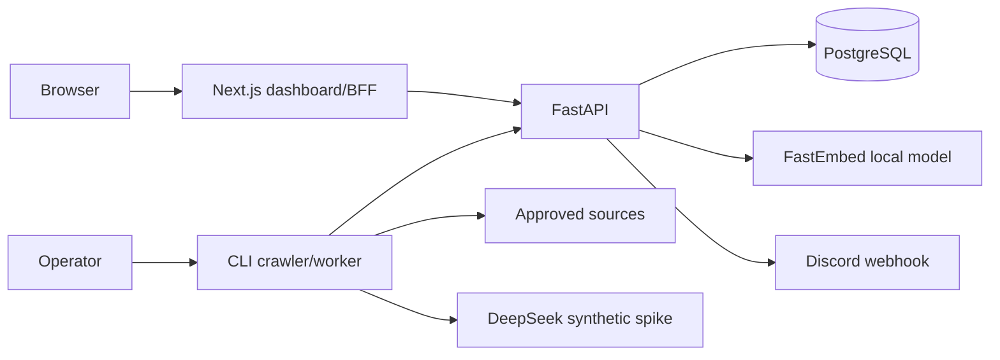
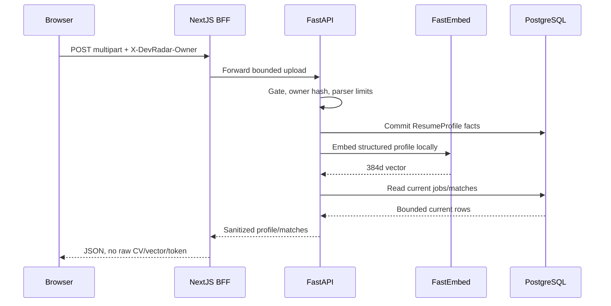
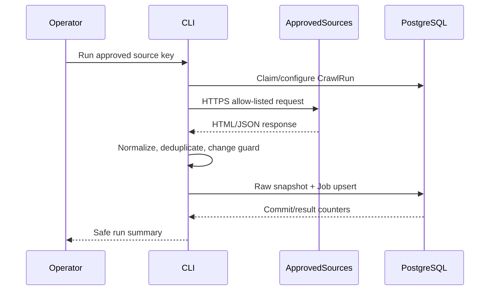

# Architecture Overview

## System Purpose

DevRadar thu thập, chuẩn hóa và phân tích job IT công khai, sau đó cung cấp REST
API và dashboard Next.js cho single operator. V5 bổ sung protected CV matching và
Discord alert delivery; V6 chuẩn bị auth, public exposure và vận hành production-like.

## Key Components

| Component | Type | Description |
|-----------|------|-------------|
| FastAPI | Process | REST API, owner/local gates, matching và alert dispatch. |
| NextJS | Process | Browser-facing App Router dashboard và same-origin BFF. |
| CLI | Process | On-demand ingestion/worker entrypoint trong crawler profile. |
| PostgreSQL | Data Store | System of record cho job, provenance, profile, match và alert delivery. |
| FastEmbed | Process | Fixed local multilingual MiniLM inference boundary. |
| ApprovedSources | External Service | Allow-listed public job sources trả HTML/JSON/API payload. |
| Discord | External Service | Operator-owned webhook notification provider. |
| DeepSeek | External Service | Synthetic-only V3 spike provider, không production path. |
| Browser | External Interactor | Người dùng tương tác với dashboard và BFF. |
| Operator | External Interactor | Single operator bật gate, chạy CLI và quản lý secret. |

## Component Diagram



## Top Scenarios

### Scenario 1: Protected CV matching

Browser gửi owner token và CV tới same-origin BFF. FastAPI kiểm tra local gate,
parse bounded file, ghi structured profile, chạy local embedding ngoài transaction
và trả match hiện tại; raw file/text không đi vào response hoặc log.



### Scenario 2: Approved source ingestion

Operator chạy CLI/worker cho source đã approved. Adapter chỉ sinh outbound request
từ registry, fetch policy kiểm SSRF/redirect/size, rồi caller-owned transaction ghi
snapshot và canonical job vào PostgreSQL.



### Scenario 3: Idempotent alert dispatch

Operator dùng protected alert route để evaluate active jobs. FastAPI claim delivery
theo rule/job/content hash, gửi message bounded tới Discord và cập nhật status;
replay `sent` bị bỏ qua.

```mermaid
sequenceDiagram
    participant O as Operator
    participant B as Browser
    participant N as NextJS BFF
    participant A as FastAPI
    participant P as PostgreSQL
    participant D as Discord
    O->>B: Enter owner token
    B->>N: POST /alert-rules/{id}/dispatch
    N->>A: Forward owner header
    A->>P: Claim unique AlertDelivery key
    A->>D: HTTPS bounded webhook message
    D-->>A: 2xx or transient error
    A->>P: Mark sent/failed and attempt count
    A-->>N: Dispatch counts
    N-->>B: Safe status; replay skips sent row
```

## Technology Stack

| Layer | Technologies |
|-------|--------------|
| Languages | Python 3.13, TypeScript/React 19 |
| Frameworks | FastAPI 0.141, SQLAlchemy/Alembic, Next.js 16 App Router, Playwright verification |
| Data Stores | PostgreSQL 18 + pgvector 0.8.6, ephemeral CV profile/match/alert tables |
| Infrastructure | Docker Compose, loopback ports 127.0.0.1:8000/3000/55432, optional crawler sandbox |
| Security | Owner hash/local gates (temporary), source allow-list/SSRF policy, bounded parsers, fixed model hash, structured redaction |

## Deployment Model

Compose runs API, database and optional crawler on one operator workstation. Host
ports bind to loopback; API container listens on `0.0.0.0:8000` only inside its
container network, while Next.js starts on `127.0.0.1:3000`. No public ingress,
TLS terminator, auth middleware, rate limiter or managed secret store is present
at current HEAD.

**Deployment Classification:** `LOCALHOST_SERVICE`

### Component Exposure Table

| Component | Listens On | Auth Required | Reachability | Min Prerequisite | Derived Tier |
|-----------|------------|---------------|--------------|------------------|-------------|
| FastAPI | container `0.0.0.0:8000`, host `127.0.0.1:8000` | No production auth; local gates/owner header | Localhost Only | Local Process Access | T2 |
| NextJS | `127.0.0.1:3000` | No production auth | Localhost Only | Local Process Access | T2 |
| CLI | N/A — no listener | Operator invocation | No Listener | Host/OS Access | T3 |
| PostgreSQL | container `5432`, host `127.0.0.1:55432` | DB password only; local default | Localhost Only | Local Process Access | T2 |
| FastEmbed | N/A — in-process model | N/A | No Listener | Host/OS Access | T3 |
| ApprovedSources | N/A — outbound target | Source policy, not user auth | No Listener | Host/OS Access | T3 |
| Discord | N/A — outbound target | Webhook secret | No Listener | Host/OS Access | T3 |
| DeepSeek | N/A — outbound synthetic spike | API key | No Listener | Host/OS Access | T3 |
| Browser | N/A — client | No public auth | Localhost Only | Local Process Access | T2 |
| Operator | N/A — human actor | Local workstation account | No Listener | Host/OS Access | T3 |

## Security Infrastructure Inventory

| Component | Security Role | Configuration | Notes |
|-----------|---------------|---------------|-------|
| Docker Compose | Process/network boundary | `compose.yaml` loopback bindings, read-only app, dropped caps | No network-level egress enforcement proven. |
| FastAPI gate dependencies | Local authorization boundary | `DEVRADAR_*_LOCAL_ENABLED`, `X-DevRadar-Owner` | Temporary V5 control; not public auth. |
| SourceRegistry/SafeHttpFetcher | SSRF and source policy | allow-list, resolved IP/redirect/size checks | Protects outbound crawler path. |
| Resume parser | File trust boundary | MIME/signature/size/decode limits | Raw CV not persisted. |
| Observability redaction | Logging boundary | allow-list JSON events | Does not replace auth or retention controls. |
| Alembic/PostgreSQL constraints | Integrity boundary | migrations, FK/check/unique indexes | DB role least privilege is deployment TODO. |

## Repository Structure

| Directory | Purpose |
|-----------|---------|
| `src/devradar/api/` | FastAPI routes, validation and gates |
| `src/devradar/ingestion/` | Approved source registry, fetch, adapters and runner |
| `src/devradar/matching/` | Resume profile, scoring and JobMatch |
| `src/devradar/alerts/` | Alert rule evaluation, Discord connector and delivery history |
| `src/devradar/intelligence/` | Extraction, taxonomy, embeddings and synthetic spike |
| `web/src/` | Next.js dashboard, BFF and protected client panels |
| `migrations/` | Alembic schema source of truth |
| `docs/` | Product, architecture, ADR, evidence and threat reports |
