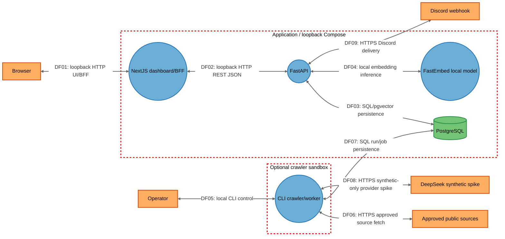

# Threat Model

## Data Flow Diagram

## Element Table

| Element | Type | TMT Category | Description | Trust Boundary |
|---------|------|--------------|-------------|----------------|
| Browser | External Interactor | SE.EI.TMCore.Browser | Local browser user agent rendering Next.js | External |
| Operator | External Interactor | SE.EI.TMCore.User | Single operator controlling local runs/secrets | External |
| ApprovedSources | External Interactor | SE.EI.TMCore.WebSvc | Allow-listed public job sources | External |
| Discord | External Interactor | SE.EI.TMCore.WebSvc | Discord webhook endpoint | External |
| DeepSeek | External Interactor | SE.EI.TMCore.WebSvc | Synthetic-only V3 provider | External |
| NextJS | Process | SE.P.TMCore.WebApp | App Router dashboard and BFF | Application |
| FastAPI | Process | SE.P.TMCore.WebSvc | REST API, gates and domain operations | Application |
| PostgreSQL | Data Store | SE.DS.TMCore.SQL | Canonical and derived persistence | Application |
| FastEmbed | Process | SE.P.TMCore.OSProcess | Local fixed-revision embedding inference | Application |
| CLI | Process | SE.P.TMCore.OSProcess | Ingestion/worker entrypoint | CrawlerSandbox |

## Data Flow Table

| ID | Source | Target | Protocol | Description |
|----|--------|--------|----------|-------------|
| DF01 | Browser | NextJS | HTTP loopback | UI and same-origin BFF requests. |
| DF02 | NextJS | FastAPI | HTTP JSON loopback | REST calls with owner header when protected. |
| DF03 | FastAPI | PostgreSQL | SQL/TCP | Parameterized reads and writes, including pgvector. |
| DF04 | FastAPI | FastEmbed | Local call | Structured profile/query embedding without external provider. |
| DF05 | Operator | CLI | Local process | Operator invokes bounded crawler/worker commands. |
| DF06 | CLI | ApprovedSources | HTTPS | Allow-listed source fetch with SSRF/redirect policy. |
| DF07 | CLI | PostgreSQL | SQL/TCP | CrawlRun, snapshot and Job persistence. |
| DF08 | CLI | DeepSeek | HTTPS | Opt-in synthetic evaluation only. |
| DF09 | FastAPI | Discord | HTTPS | Bounded alert message with DB idempotency key header. |

## Trust Boundary Table

| Boundary | Description | Contains |
|----------|-------------|----------|
| Application | Loopback-hosted Next.js/API/database/model Compose services | NextJS, FastAPI, PostgreSQL, FastEmbed |
| CrawlerSandbox | Optional non-root browser/crawler container with sandbox profile | CLI |
| External | Browser/operator actors and third-party HTTP endpoints | Browser, Operator, ApprovedSources, Discord, DeepSeek |
